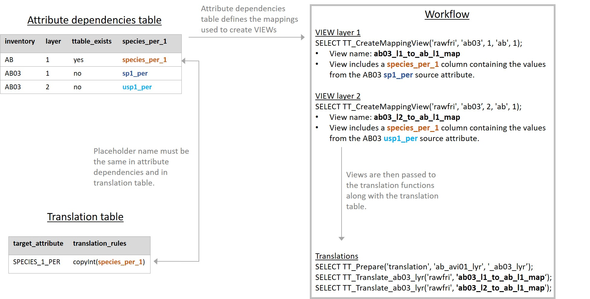
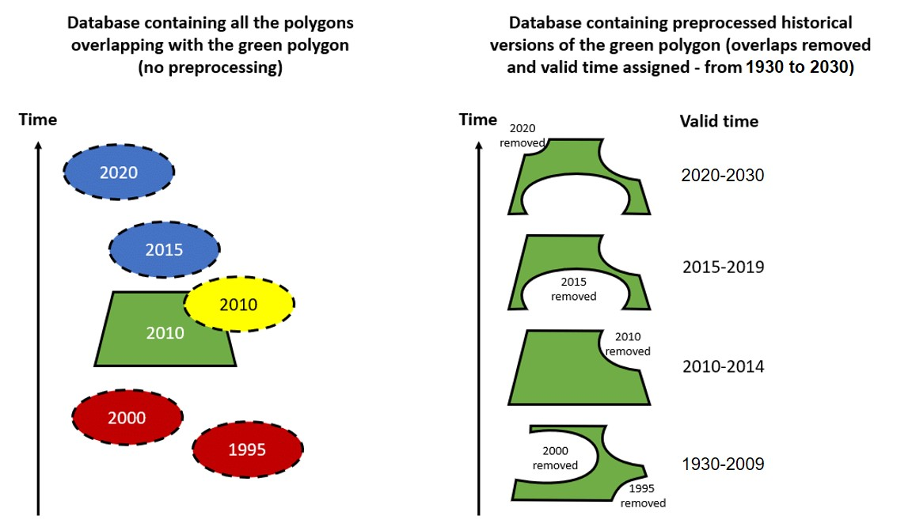

[](https://casfri.github.io/CASFRI/)

https://casfri.github.io/CASFRI/

# Introduction
Digital Forest Resource Inventories (FRIs) are compiled by provincial and territorial governments and are key inputs into forest management planning. They have also been used widely to model species habitat in the Canadian boreal forest and, in combination with climate and weather data, to model wildfire size and frequency. FRI datasets consist of stand maps interpreted from aerial photography at scales ranging from 1:10,000 to 1:40,000. They are typically conducted on a 10- to 20-year cycle and may be periodically updated to reflect changes such as burned areas, harvesting, insect damage, silviculture, and forest growth. The stand maps estimate the location, extent, condition, composition, and structure of the forest resource. Each jurisdiction has developed its own procedures and standards for forest inventories. 

The Common Attribute Schema for Forest Resource Inventories (CASFRI) standardizes FRI data from each jurisdiction in Canada, allowing a national FRI relational database to be created with continuous coverage. A major challenge in assembling a national coverage of FRI data is reconciling the many differences in variable formats, attributes, and standards among disparate inventories. Standardization is necessary so that models can be developed using data from multiple jurisdictions or inventory versions.

The [CASFRI specifications](https://github.com/edwardsmarc/CASFRI/tree/master/documentation/specifications) document the CAS database schema. It focuses on the most common attributes that are consistently recorded in forest inventories across Canada and which are relevant to habitat modeling and state of forest reporting. These attributes include crown closure, species composition, height, mean canopy or stand origin age, stand structure, moisture regime, site class or site index, non-forested cover types, non-vegetated cover types, and disturbance history.

A number of CASFRI instances have been produced since 2009. CASFRI 5 is the fifth version of CASFRI. It makes a number of significant updates to previous versions:

* Addition of new and more up-to-date inventories.
* Implementation of a new conversion and loading procedure focused around the open source software GDAL/OGR (in place of ArcGIS).
* Implementation of an SQL based translation framework abstracting the numerous issues related to this kind of conversion to simple translation tables.
* Implementation of a temporalization procedure to create a temporal database of all available inventories.
* Implementation of a descriptive error code system.

The three main steps involved in the production of the CASFRI 5 database are:

1. **Conversion** (from many different FRI file formats) and loading (into a PostgreSQL database) using Bash scripts and ogr2ogr.
2. **Translation** of the loaded FRIs to the CASFRI schema (inside the PostgreSQL database)
3. **Temporalization** of CAS data (inside the PostgreSQL database)

Note that forest resource inventories are not provided with this project due to the numerous licensing agreements that have to be passed with the different production juridictions. Many provincial inventories can now be downloaded for free from government web sites. All the inventories supported by this project are documented in [this table](https://github.com/edwardsmarc/CASFRI/blob/master/documentation/inventory_list_cas05.csv).

# Citation
CASFRI Project Team (2021). Common Attribute Schema for Forest Resource Inventories. Université Laval, QC, Canada. URL https://casfri.github.io/CASFRI/. DOI: 

# Version Number Scheme

CASFRI follows the [Semantic Versioning 2.0.0](https://semver.org/) versioning scheme (major.minor.revision) adapted for a dataset. Increments in revision version numbers are for bug fixes. Increments in minor version numbers are for new features, support for new inventories, additions to the schema (new attributes), and bug fixes. Increments in minor versions do not break backward compatibility with previous CASFRI schemas. Increments in major version numbers are for schema changes that break backward compatibility with existing code (e.g. renaming attributes, removing attributes, and inventory support deprecation).

The current version is 5.3.1 and is available for download at https://github.com/edwardsmarc/CASFRI/releases/tag/v5.3.0

# Directory Structure
<pre>
./                                      Sample files for configuring and running scripts

./conversion                            Bash scripts for converting and loading FRI datasets

./docs                                  GitHub enabled website

./documentation/specifications          CASFRI specifications document

./helperfunctions                       CASFRI specific helper functions used in translation tables

./helperfunctions/geohistory            Functions used to build historical version of CASFRI

./summary_statistics                    R scripts to summarize CASFRI output for validation checks

./translation/tables                    Translation tables and associated loading scripts

./translation/test                      Unit tests for CASFRI translations

./workflow/01_develTranslationTables    Translation scripts used for development and testing on sample versions of source tables

./workflow/02_produceCASFRI             Translation scripts to run all complete translations

./workflow/03_flatCASFRI                Scripts to build a flat (denormalized) version of CASFRI 

./workflow/04_produceHistoricalTable    Scripts to build a historical version of CASFRI and for computing inventories coverage polygons
</pre>

# Requirements

The production process of CASFRI 5 requires:

* [GDAL v3.1.x](https://www.gisinternals.com/query.html?content=filelist&file=release-1911-x64-gdal-3-1-4-mapserver-7-6-1.zip) and access to a Bash shell to convert and load FRIs into PostgreSQL. IMPORTANT: Some FRIs will not load with GDAL v2.x. This is documented as [issue #34](https://github.com/edwardsmarc/CASFRI/issues/34). Production has also been tested using GDAL 1.11.4.

* PostgreSQL 13.1+ and PostGIS 3.1+ to store and translate the database (PostgreSQL 11/12 and PostGIS 2.3.x have also been tested). More recent versions should work as well.

* The [PostgreSQL Table Translation Framework](https://github.com/edwardsmarc/PostgreSQL-Table-Translation-Framework) to translate the database.

# Vocabulary
**Source data -** Raw FRI data received from jurisdictions.

**Loaded source table -** Raw FRI data converted and loaded into PostgreSQL.

**Target table -** FRI table translated into the CASFRI specifications.

**Translation table -** User created table detailing the validation and translation rules and converted to SQL queries by the translation framework.

**Lookup table -** User created table used in conjunction with the translation tables; for example, to recode provincial species lists to a standard set of 8-character codes.

**Translation framework -** The [PostgreSQL Table Translation Framework](https://github.com/edwardsmarc/PostgreSQL-Table-Translation-Framework).

**Helper function -** A set of PL/pgSQL functions used in the translation table to facilitate validation of source values and their translation to target values.

# FRI and Inventory Standard Identifiers
CASFRI 5 uses a four characters unique code named "inventory_id" to identify each FRI. This code is composed of two letters for the province or territory, and two numbers that increment for each new FRI added for that province/territory (e.g. BC01). Note that higher numbers do not necessarily imply more recent inventories.

Inventory standards are the attribute specifications applied to a given inventory. Multiple FRIs from a province/territory can use the same standard, however jurisdictions will occasionally update their standards, and each jurisdiction has their own unique inventory standards. The CASFRI specifications need to apply different sets of translation rules for different standards. Each standard is assigned a code made of three letters representing the standard, and two numbers representing the version of the standard (e.g. VRI01). 

All identifiers are listed in the [FRI inventory list CSV file](https://github.com/edwardsmarc/CASFRI/blob/master/documentation/inventory_list_cas05.csv) that lists all the forest inventories used as source datasets in this project.

# Handling Updates
Historical forestry data is of great value which is why CASFRI accommodates updates. One type of update which is often seen in FRIs is re-inventories, i.e., when old photo-interpretation is updated to modern standards. The other types of update are so-called "depletion updates" related to various disturbances. In many jurisdictions, depletion-updates are produced annually to "cut-in" polygons disturbed by harvesting, wildfire or insects. Both types of updates are incorporated in CASFRI 5 by loading and translating the updated dataset and labelling the dataset with an incremented identifier (inventory_id). Any duplicate records will be dealt with in the temporalization procedure.

For an update to be incorporated in the database, the date of publication should be at least one year apart from a previous version. When data are available online, this information can be found in the metadata. For data received from a collaborator, information on the last version received should be shared in order to identify if any new datasets meet the 1-year criteria.   

# Conversion and Loading
Conversion and loading happen at the same time and are implemented using GDAL/OGR tools. Every source FRI has a single loading script that creates a single target table in PostgreSQL. If a source FRI is composed of multiple files, the conversion/loading scripts append them all into the same target flat table. Some FRIs are accompanied by an extra shapefile that associates each stand with a photo year. These are loaded with a second script. Every loading script adds a new "src_filename" attribute to the loaded source table with the name of the source file, and "inventory_id", the inventory unique identifier. These are used when constructing the CAS_ID (a unique identifier tracing each target row back to its original row in the source dataset).

### Supported File Types
All conversion/loading scripts are provided as .sh files.

Currently supported FRI formats are:

* Geodatabase
* Shapefile
* Arc/Info Binary Coverage

Arc/Info E00 files are not currently well supported by GDAL/OGR. Source tables in this format should be converted into a supported format using another software package before loading (e.g. to a file geodatabase).

### Projection
All source tables are transformed to the Canada Albers Equal Area Conic projection by GDAL/OGR during loading.

### Configuration File
A config.sh file is required in the CASFRI root directory to set local paths and preferences. A template files is provided (configSample.sh) which can be copied and edited to match your configuration.

### Source Data Folder Structure
Conversion and loading scripts are written so that FRIs to convert and load must be stored in a specific folder hierarchy (using inventory AB06 as an example):

FRI/  
├─AB/  
│ ├─AB06/  
│ │ ├─data/  
│ │ │ ├─archive/  
│ │ │ ├─coverage/  
│ │ │ ├─inventory/  
│ │ │ └─photoyear/  
│ │ ├─doc/  
│ │ │ ├─archive/  
│ │ │ ├─emailexchange/  
│ │ │ ├─manual/  
│ │ │ │ ├─others/  
│ │ │ └─map/  
│ │ ├─license/  
│ │ └─toclassify/  
│ └─AB16/  
│ │ ├─data/  
│ │ ├─doc/  
│ │ ├─.../  
├─BC/  
│ ├─.../  

# Translation
Translation of loaded source tables into target tables formatted to the CASFRI specification is done using the [PostgreSQL Table Translation Framework](https://github.com/edwardsmarc/PostgreSQL-Table-Translation-Framework). The translation framework uses a translation table that describes rules to validate each loaded source table and translate each row into the target table. Validation and translation rules are defined using a set of helper functions that both validate the source attributes and translate into the target attributes. For example, a function named isBetween() validates that the source data is within the expected range of values, and a function named mapText() maps a set of source values to a set of target values. A list of all helper functions is available in the PostgreSQL Table Translation Framework [readMe](https://github.com/edwardsmarc/PostgreSQL-Table-Translation-Framework). After the framework has processed all loaded source tables, the result is a complete set of target tables, each with matching attributes as defined by the CASFRI standard. 

### Translation Tables
A detailed description of translation table properties is included in the [PostgreSQL Table Translation Framework](https://github.com/edwardsmarc/PostgreSQL-Table-Translation-Framework). In short, each translation table lists a set of attribute names, their type in the target table, a set of validation helper functions which all input values have to pass, and a set of translation helper functions to convert input values to CASFRI values. A set of generic helper functions are included with the [PostgreSQL Table Translation Framework](https://github.com/edwardsmarc/PostgreSQL-Table-Translation-Framework), these perform standardized validations and translations that are used in many different translation tables. The CASFRI project also has its own more specific set of [helper functions](https://github.com/edwardsmarc/CASFRI/tree/master/helperfunctions) that apply more complex translations specific to individual inventories.

CASFRI is split into seven tables as detailed in the [CASFRI specifications](https://github.com/edwardsmarc/CASFRI/tree/master/documentation/specifications):
1. **Header (HDR) attributes -** summarizing reference information for each dataset;  
2. **CAS Base Polygon (CAS) attributes -** describing the source polygon and any identifiers;  
3. **Forest-Level (LYR) attributes -** describing productive and non-productive forest land;  
4. **Non-Forest Land (NFL) attributes -** describing non-forested land;  
5. **Disturbance history (DST) attributes -** describing the type, year and extent of disturbances;  
6. **Ecological specific (ECO) attributes -** describing wetlands;  
7. **Geometry attributes (GEO) -** polygon geometries.

In general, each standard for each jurisdiction uses a single set of translation tables. All source datasets using the same standard should use the same set of translation tables. Differences in attribute names can be accommodated using the workflow scripts described below. In some cases minor differences in attributes between datasets using the same standard can be accommodated by designing translation helper functions that can deal with both formats. An example would be two datasets using the same standard, but different values for graminoids (e.g. 'Grm' in one dataset and 'graminoids' in another). These can be combined into a single translation function to deal with both datasets in the translation table (e.g. mapText(source_value, {'Grm', 'graminoids'}, {'GRAMINOID', 'GRAMINOID'})).

### Row Translation Rule
An important feature of the [PostgreSQL Table Translation Framework](https://github.com/edwardsmarc/PostgreSQL-Table-Translation-Framework) is the use of a ROW_TRANSLATION_RULE in the translation table. This allows the loaded source table to be filtered during translation so that only relevent rows are translated to the target table. This ensures that the LYR table for example, only includes rows that contain forest information.

### Error Codes
Error codes are needed during translation if source values are invalid, null, or missing. In CASFRI 5, error codes have been designed to match the attribute type and to reflect the type of error that was encountered. For example, an integer attribute will have error codes reported as integers (e.g. -8888) whereas text attributes will have errors reported as text (e.g. NULL_VALUE). Different error codes are reported depending on the rule being invalidated. A full description of possible error codes can be found in the [CASFRI 5 specification document](https://github.com/edwardsmarc/CASFRI/tree/master/documentation/specifications).

### Validating Translations
Validation is performed at multiple stages during and after translation:

* **Validation of source values** - All source values are validated before attempting translation using the validation helper functions described in the [PostgreSQL Table Translation Framework](https://github.com/edwardsmarc/PostgreSQL-Table-Translation-Framework).

* **Validation of translation tables by the translation framework** - The [PostgreSQL Table Translation Framework](https://github.com/edwardsmarc/PostgreSQL-Table-Translation-Framework) validates the translation rules and formatting in each translation table prior to attempting translation.

* **Validation of the translated CASFRI** - The [constraints](https://github.com/edwardsmarc/CASFRI/tree/master/workflow/02_produceCASFRI/03_ConstraintsChecksAndIndexes) scripts adds a set of database constraints to the translated tables. These constraints ensure that the translated data conform to the CASFRI standard as outlined in the [CASFRI 5 specification document](https://github.com/edwardsmarc/CASFRI/tree/master/documentation/specifications).

* **Horizontal review of translation tables** - The function TT_StackTranslationRules() creates a table of all translation and validation rules used for all inventories for a given CASFRI table. This allows manual validation of all translation rules and assignment of error codes for a given attribute.

* **Validation of output using summary statistics** - The [summary_statistics](https://github.com/edwardsmarc/CASFRI/tree/master/summary_statistics) folder contains scripts (primarily summarize.R) to create summary statistics for all attributes in each source inventory. These scripts use the R programming language and require that R be downloaded (https://www.r-project.org/). The output is a set of html files containing the summary information. These can be used to check for outliers, unexpected values, correct assignment of error codes etc.

### Workflow Scripts
The translation of each dataset is done using the scripts in the [CASFRI/workflow/02_produceCASFRI/02_perInventory](https://github.com/edwardsmarc/CASFRI/tree/master/workflow/02_produceCASFRI/02_perInventory) folder. The main translation functions are TT_Prepare() which validates and prepares the translation table, and TT_Translate() which perform the translation. These are described in detail in the [PostgreSQL Table Translation Framework](https://github.com/edwardsmarc/PostgreSQL-Table-Translation-Framework). 

It is important that a single translation table can be used for multiple translations, either for different layers within the same dataset, or for different datasets using the same standard but different attributes names. The workflow scripts accommodate this by combining three elements:

**1. Placeholder names in translation table helper functions -** Translation table helper functions use placeholder attribute names instead of actual inventory attribute names. Every translation using a common translation table to translate similar inventories must map inventory attribute names to these placeholder column names. That's how a single translation table can be reused to translate many inventories from the same juridiction. Otherwise many translation tables using the same helper functions but with different attribute names would have to be created. In the workflow script VIEWs are created to map the source inventory attribute names to the placeholder attribute names found in the translation table. One can then run the same translation using as many different VIEWs as there are inventories.

**2. Attribute dependency table -** This table defines the mapping of attributes from each source table to the placeholder names used in the translation tables. For a given translation table, the attribute dependencies table contains a row for the translation table placeholder names, and rows for each translation that needs to be completed using a source inventory. If multiple layers have to be translated for an inventory, multiple rows must be defined in the attribute dependencies table. This table has the following columns:

* **inventory_id -** either a name representing the translation table (e.g. AB) or a name matching a source inventory dataset (e.g. AB03).
* **layer -** a unique integer value incrementing for LYR layers followed by NFL layers.
* **ttable_exists -** indicates if the row represents the placeholder names of an existing translation table or only the source inventory attribute names for which no actual translation table exists.

All other columns represent target attributes in the CASFRI tables. The values in each cell list the attributes to be mapped to the translation table placeholder names. In the case of the translation table rows, the values must match the placeholder names used in the translation table. In the case of rows representing source datasets, the values represent source attribute names.

**3. TT_CreateMappingView() -** The function TT_CreateMappingView() is used to create the VIEWs used in the workflow by mapping the attributes defined in the attribute dependencies table from the source names to the translation table placeholder names. It has the following arguments:

* **Schema name:** schema the source inventory was loaded to
* **From table name (optional):** inventory_id of source inventory row in attribute dependencies table
* **From layer (optional, default to 1):** matches the layer value in the attribute dependencies table
* **To table:** inventory_id of the row listing the translation table placeholder names
* **To layer (optional, default to 1):** matches the layer value in the attribute dependencies table (for our purposes this is always set to 1)
* **Number of rows (optional, default to all rows):** number of random rows to select. If blank, all rows are selected.

The function creates a view with a name based on the input arguments:
If only the 'from table name' is provided, a VIEW with a minimal set of attributes and no mappings is created. For example `SELECT TT_CreateMappingView('rawfri', 'ab03', 200);` creates a view named **ab03_min_200** in the **rawfri** schema.

If both a 'from' and a 'to' table are provided, the 'from' names (i.e. the source data) are mapped to the 'to' names (i.e. the translation table placeholder names), defaulting to use layer 1. For exampe `SELECT TT_CreateMappingView('rawfri', 'ab03', 'ab');` creates a view name **ab03_l1_to_ab_l1_map** in the **rawfri** schema..

If 'layer' integers are provided, the row corresponding to the provided layer number will be used for the mapping. For example `SELECT TT_CreateMappingView('rawfri', 'ab03', 2, 'ab', 1);` creates a view name **ab03_l2_to_bc_l1_map** in the **rawfri** schema.

If the 'number of rows' are provided, the view name ends with the number of randomly selected rows. For example `SELECT TT_CreateMappingView('rawfri', 'ab03', 2, 'ab', 1, 200);` creates a view name **ab03_l2_to_ab_l1_map_200** in the **rawfri** schema.

The following diagram illustrates the relationship between the translation table, the attribute dependencies table, and TT_CreateMappingView() using a simple attribute - SPECIES_1_PER. The translation rule is a simple copy, but the attribute has a different name for layer 1 and layer 2 in the AB03 source dataset. Each layer is run as a separate translation: for the layer 1 translation the source attribute sp1_per needs to be mapped to the placeholder name (species_per_1), and for the layer 2 translation the understory attribute usp1_per needs to be mapped to the placeholder name (species_per_1). Views are used to map from the source attribute names to the placeholder names used in the translation table.



# Translation Procedure
The steps to produce a complete build of the CASFRI database are detailed in the [release procedure](https://github.com/edwardsmarc/CASFRI/blob/master/documentation/release_procedure.md). A subset of these steps can be used to translate a single dataset as follows:

1. **Configure** your processing environment in the config.sh file.
2. **Load the inventory** (e.g. AB03) into PostgreSQL by launching the conversion/sh/load_ab03.sh loading script in a Bash (or DOS) command window. You can also launch many conversions in parallel. This is described in the Parallelization section.
3. **Load the translation tables** into PostgreSQL by launching the CASFRI/translation/load_tables.sh script.
4. **Install the PostgreSQL Table Translation Framework and the CASFRI Helper Functions**
    1. Install the last version of the PostgreSQL Table Translation Framework extension file using the install.sh script. This step produces a file named table_translation_framework--x.y.z.sql in the Postgresql/XX/share/extension folder.
    2. In pgAdmin, load the Table Translation Framework and the CASFRI Helper Functions:
        1. CREATE the table_translation_framework extension and test it using the engineTest.sql, helperFunctionsTest.sql and helperFunctionsGISTest.sql scripts.
        2. Load the CASFRI Helper Functions with the helperFunctionsCASFRI.sql script and test them using helperFunctionsCASFRITest.sql.
5. **Run the translation** by launching the workflow SQL script (CASFRI/workflow/02_produceCASFRI/02_perInventory/02_AB03.sql) in pgAdmin (or a psql window). You can also launch many translations in parallel. This is described in the Parallelization section.

Translated data is added to the six output tables in the 'casfri50' schema: cas_all, dst_all, eco_all, lyr_all, nfl_all, geo_all. The scripts in the [CASFRI/workflow/03_flatCASFRI/](https://github.com/edwardsmarc/CASFRI/tree/master/workflow/03_flatCASFRI) folder can be used to create two different denormalized tables, one where all layers for a given polygon are reported on the same row, and one where all layers for a given polygon are reported on different rows. The former is necessary since it is the table used to generate the historical version of the CASFRI database.

The steps to add a completey new inventory to the CASFRI database are detailed in issue [#471](https://github.com/edwardsmarc/CASFRI/issues/471).

# CASFRI Historical Table
The six tables found in the 'casfri50' schema as the result of a complete translation gathers stands from many inventories, where polygons sometimes overlapping each other in space and time (e.g. BC08, BC10, BC10 and BC11). That means if you try to match an observation point made at a specific year, you might end up with more than one matching stand. Either because they overlap in space (some inventories have many polygons of the same year overlapping between them), in time (the valid time of one inventory (e.g. 2000-2010) overlaps the valid time of the following inventory (2008-2015)) or both.

The historical version of the CASFRI database is a new geometry table replacing the geo_all table where no two polygons share a same space at a specific time (i.e. no two polygons overlap in space and time). In this table, stand polygons are cut so that only polygons parts from the most up to date inventory at the date of observation can be matches. It allows querying for the best available inventory information at any point in time accross the full CASFRI coverage.

The historical table is created using the [02_ProduceGeoHistory.sql](https://github.com/edwardsmarc/CASFRI/tree/master/workflow/04_produceHistoricalTable) script as described in the [release procedure](https://github.com/edwardsmarc/CASFRI/blob/master/documentation/release_procedure.md). It uses the stand_photo_year of each polygon as the reference date to determine its valid start and end time. Each polyon is intersected with all other overlapping polygons and the resulting polygon parts are assigned a valid_year_begin and a valid_year_end value. In the case of overlaps, the polygon with the most complete information is prioritized as described below.

The following diagram illustrates the temporalization procedure for a single polygon:



Valid start and end dates are assigned using the following rules:
* Each polygon is attributed a valid_year_begin year and a valid_year_end based on their CAS table stand_photo_year attribute value. By default, if a polygon does not overlap with another one in space and time, valid_year_begin is assigned 1930 and valid_year_end is assigned 2030
* When two polygons overlap:

  * More recent polygons areas take precedence over older polygons areas starting at their valid_year_begin (e.g. a polygon from 2010 take precedence over a 2000 polygon starting in year 2010. The 2000 polygon has precedence from 1930 until 2009)
  * When both polygons have the same stand_photo_year, the polygon with valid values take precedence over polygons with invalid values. Invalid values are defined as all significant CASFRI attributes being NULL or empty. This rarely happens, but if it does, the polygon with valid values takes precedence.
  * When both polygons have the same stand_photo_year and valid values but come from different inventories, polygons from higher precedence inventories as established by the TT_HasPrecedence() function and the casfri50_history_test.inv_precedence table takes precedence. For example, if two overlapping 2010 polygons both have all valid values but the first comes from AB10 and the second comes from AB16, then TT_HasPrecedence() states that the AB16 polygon must take precedence.
  * When both polygons have the same stand_photo_year, valid values and the same TT_HasPrecedence() precedence, then both polygons are sorted by their unique identifier (cas_id) and the first one has precedence over the second one.

No interpolation or interpretation of attributes is performed. For this reason the historical table can be queried to recreate the 'state of the inventory' for a given year, but not necessary the 'state of the forest'. The 'state of the inventory' is the best available information for a given point in time, whereas the 'state of the forest' would require modelling the exact forest attributes for every year based on time since disturbance. This is beyond the scope of this project but the historical database could facilitate such modelling exercises for interested end users.

The historical table can be queried using valid_year_begin and valid_year_end. For example, the following query would select the most valid polygon from the historical database for all observation points in a table:
```
SELECT p.id, p.year, p.geom, gh.cas_id
FROM mypointable p, casfri50_history.geo_history gh
WHERE ST_Intersects(gh.geom, p.geom) AND gh.valid_year_begin <= p.year AND p.year <= gh.valid_year_end;
```
The resulting table can then be joined, using the CAS_id attribute, with:

  a) one of the two flat tables from the casfri50_flat schema or
  b) one of the CASFRI normalized tables from the casfri50 schema (cas_all, dst_all, eco_all, lyr_all, nfl_all).

# Parallelization
Conversion, translation, production of the historical table and production of the inventory coverages are all very long processes when translating many inventories. In it's current state, with about 50 inventories supported, the final cas_all table gathers more than 66 million rows. If you add the other CASFRI tables (eco_all, dst_all, lyr_all, nfl_all and geo_all) that's more than 225 million rows translated. If you multiply this by the number of attributes composing each CASFRI table you get more than 3 billion values to translate. Even for a powerful database management system like PostgreSQL, that's a lot of information to process. 

Much effort have been deployed during the developement of CASFRI 5 to make this process as quick and efficient as possible. Moving from PostgreSQL 11 to PostgreSQL 13 and from PostGIS 2.5 to PostGIS 3.1 has been a good step in this regard. PostgreSQL provides much better support for PARALLEL SAFE functions and PostGIS 3.1 uses the new faster GEOS 3.9 geometry library.

On the CASFRI side, all steps involving long processes have been designed so they don't block each other as it is often the case in a DBMS. You can run each process as SQL scripts to have better monitoring and debugging control, or you can batch run them all in parallel using Bash shell scripts.

The first step to implement batch processing is to define the list of inventories to translate with the invList1 to invList5 variables in your config.sh configuration script. Each invListX variable lists a subset of the complete list of inventories to process. Inventories listed in one invListX variable are processed in parallel. invListX variables are processed sequentially. Once the last inventory of one invListX variable is finished, the script processes the inventories listed in the next invListX variable. This is a way to balance between processing as many inventories in parallel as possible, and overloading (and possibly crashing) PostgreSQL with too much processing at the same time. Finding the right balance can be difficult and a frustrating exercise. You can also edit the invListX variables to process a limited list of inventories.

Once the invListX variables have been defined, you can launch the different processing scripts in the proper order. Here is a description of those scripts:

1. ./conversion/sh/**load_all.sh** loads all the source inventories listed in the invListX variables into the PostgreSQL schema defined by the targetFRISchema variable in the configuration script (config.sh).

2. ./translation/test/**testTranslation.sh** runs translation tables on subsets of source inventories. The resulting tables are compared with archived tables for desired or undesired differences. This quick check is to make sure everything works as expected before launching the main, long translation process. This is also used to make sure nothing is broken while developping new features or fixing issues. The resulting tables are written to the casfri50_test schema.

4. ./workflow/02_produceCASFRI/**01_translate_all_00.sh** prepares the database before launching the main translation process.

5. ./workflow/02_produceCASFRI/**01_translate_all_01.sh** is the main translation script. It will translate all the source inventories listed in the invListX variables to the CASFRI schema. The resulting tables are written to the casfri50 schema.

6. The next step is to produce the flat, denormalized tables. This process is not parallelizable and is not managed by .sh scripts. You must simply run the two .sql scripts. The resulting tables are written to the casfri50_flat schema.

7. ./workflow/04_produceHistoricalTable/**01_PrepareGeoHistory.sh** prepares the database before launching the historical table production process. It will create the target table and split the whole geometric coverage into a grid for faster processing. The required functions need to be loaded by calling geoHistory.sql before running 01_PrepareGeoHistory.sh.

8. ./workflow/04_produceHistoricalTable/**02_ProduceGeoHistory.sh** generates the historical table based on the invListX variables. The resulting tables are written to the casfri50_history schema.

9. ./workflow/04_produceHistoricalTable/**03_ProduceInventoryCoverages.sh** generates a set of tables with the inventories geographic coverage polygons simplified at different levels. The resulting tables are written to the casfri50_coverage schema.

There is still much work to do to optimize the speed of many helper functions and to make them PARALLEL SAFE so that not only different inventories are processed on different CPUs (on the same machine) but individual inventory processing is also split across many CPU (still on the same machine). No work has been done to split those processes across multiple machines.

# Update Procedure
The [update procedure](https://github.com/edwardsmarc/CASFRI/blob/master/documentation/inventory_update_procedure.md) is the method for incorporating new datasets without having to regenerate the whole CASFRI database. New datasets could be an entirely new inventory, or a partial inventory or depletion update.

An alternative method would be to rerun the full translation from scratch using the steps documented in this document or in the [release procedure](https://github.com/edwardsmarc/CASFRI/blob/master/documentation/release_procedure.md).

# Translation Exceptions
* **Multiple NFL value per row in AB [#526](https://github.com/edwardsmarc/CASFRI/issues/526)** - In general CASFRI accepts only one NFL value per row. If there are multiple NFL values to translate they are reported as different vertical layers. One exception to this is in the AB AVI standard where the non-forest type _rough pasture_ is always accompanied by a _shrub_ value indicating the height and extent of shrub cover in the _rough pasture_. This combination can also form horizontal structure within a polygon, with a structure percent value indicating how much of the polygon is covered. CASFRI cannot currently represent both horizontal and vertical structure in the same polygon. For this reason both the _rough pasture_ (translated to CASFRI value CULTIVATED) and the _shrub_ (translated to CASFRI value TALL_SHRUB or LOW_SHRUB) values are reported in the same layer. The workflow is such that this behavior has to be applied consistently across the full dataset, meaning that some AB inventories will have cases of multiple NFL values per row, beyond the _rough pasture_ _shrub_ combination already mentioned.
* **53 rows in PEI are missing SPECIES_3 [#676](https://github.com/edwardsmarc/CASFRI/issues/676)** - species need to be ordered by non-null values, so if SPECIES_3 is missing, SPECIES_4 becomes SPECIES_3. This will be completed but the bug was not found in time for the March 31st release. 
* **Height calculation in BC [#336](https://github.com/edwardsmarc/CASFRI/issues/336)** - Most inventories simply copy the height value for the layer in question, but in BC the weighted average height is calculated instead because there are multiple height values for different canopy components.
* **Horizontal structure in Parks Canada datasets** - PC01 and PC02 are the only datasets using exclusively horizontal structure. In these cases the CASFRI LAYERs represent different horizontal components. There is no vertical structure captured for these inventories.
* **QC03 photo year issue [#444](https://github.com/edwardsmarc/CASFRI/issues/444)** - Photo year in the QC 3rd inventory standard is not precise.
* **QC 3rd and 4th inventory standards do not include layer 2 info [#287](https://github.com/edwardsmarc/CASFRI/issues/287)** - Even if there are two LYR layers in many polygons, there is only forest information for the top layer. This results in many LYR rows in QC01, QC02, QC03, QC04 and QC06 where LAYER is 2 and all attributes are UNKNOWN_VALUE. Note that this was discussed in issue [#694](https://github.com/edwardsmarc/CASFRI/issues/694) and some changes have been proposed that will be incorporated into the next release. 
* **Non-productive rows in LYR tables [#632](https://github.com/edwardsmarc/CASFRI/issues/632)** - Usually source forested stands to be translated to LYR rows are identified using notEmpty() against species attributes. notEmpty() is used in the ROW_TRANSLATION_RULE and for assigning a number to the LYR LAYER attribute, the NFL LAYER attribute, and the CAS NUM_OF_LAYERS attribute. Some inventories (MB01, MB05, NB01, NB02, NL01, NS01, NS02, NS03, ON01, ON02, SK01, SK02, SK03, SK04, SK05) can have non-productive forested types (e.g. treed muskeg, alder) that do not include any species info, but still need to be reported as a LYR rows using the PRODUCTIVITY_TYPE attribute. In these cases the translation table catch the productivity type value in the ROW_TRANSLATION_RULE, and a custom functions make sure the row is counted in layer related functions.
* **CAS_ID issues** - In most inventories the translation rule is able to build the unique CAS_ID identifier using identifiers from the source data that allow the cas_id to be linked back to the source polygon. In some inventories (e.g. ON [#536](https://github.com/edwardsmarc/CASFRI/issues/536) and QC [#645](https://github.com/edwardsmarc/CASFRI/issues/645)), the unique source identifier is too long to fit in a single CAS_ID slot, so it is split across multiple slots. Additionally, ON01 has 6 cases where the unique identifier does not link back to a single source polygon ([#644](https://github.com/edwardsmarc/CASFRI/issues/644)).
* **Multiple inventories in a single source dataset** - Some source inventories were received containing data from multiple standards and were divided into multiple datasets (one for each standard) during loading. This was the case for MB05 and MB06; QC03, QC04 and QC05; and QC02, QC06 and QC07.  
* **SK01 species percent logic [#275](https://github.com/edwardsmarc/CASFRI/issues/275)** - Assignment of species percent was developed with collaborators based on the species codes present. The logic is included in a document linked to the issue.
* **ON01 species codes [#678](https://github.com/edwardsmarc/CASFRI/issues/678) [#681](https://github.com/edwardsmarc/CASFRI/issues/681)** - Species codes appear to be a combination of multiple formats. Fix in [#678](https://github.com/edwardsmarc/CASFRI/issues/678) deals with most of them, but some species codes have a single letter code that is not included in the inventory manual ([#681](https://github.com/edwardsmarc/CASFRI/issues/681)).
* **NB site_index [#578](https://github.com/edwardsmarc/CASFRI/issues/578)** - SiteI attribute could possibly be used to get some site index information.

# List of CASFRI specific helper functions 
**Found in [CASFRI/helperfunctions/](https://github.com/edwardsmarc/CASFRI/tree/master/helperfunctions)**
* HasNFLInfo
* ab_avi01_wetland_translation
* ab_avi01_wetland_validation
* ab_photo_year_translation
* ab_photo_year_validation
* avi01_non_for_veg_translation
* avi01_stand_structure_translation
* avi01_stand_structure_validation
* bc_height
* bc_lyr_layer_translation
* bc_vri01_wetland_translation
* bc_vri01_wetland_validation
* fim02_stand_structure_translation
* fim_species
* fim_species_count_validate
* fim_species_percent_translation
* fvi01_countOfNotNull
* fvi01_hasCountOfNotNull
* fvi01_stand_structure_translation
* fvi01_stand_structure_validation
* fvi01_structure_per
* fvi01_structure_per_validation
* lyr_layer_translation
* mb_fli01_stand_structure_translation
* mb_fli01_wetland_translation
* mb_fli01_wetland_validation
* mb_fri01_wetland_translation
* mb_fri01_wetland_validation
* mb_fri_countOfNotNull
* mb_fri_hasCountOfNotNull
* nb_countofnotnull
* nb_hasCountOfNotNull
* nb_lyr_layer_translation
* nb_nbi01_wetland_translation
* nb_nbi01_wetland_validation
* nbi01_nb01_productive_for_translation
* nbi01_nb02_productive_for_translation
* nbi01_stand_structure_translation
* nl_nli01_crown_closure_lower_translation
* nl_nli01_crown_closure_upper_translation
* nl_nli01_crown_closure_validation
* nl_nli01_height_lower_translation
* nl_nli01_height_upper_translation
* nl_nli01_height_validation
* nl_nli01_isCommercial
* nl_nli01_isForest
* nl_nli01_isNonCommercial
* nl_nli01_origin_lower_translation
* nl_nli01_origin_lower_validation
* nl_nli01_origin_newfoundland_validation
* nl_nli01_origin_upper_translation
* nl_nli01_productivity_translation
* nl_nli01_productivity_type_translation
* nl_nli01_wetland_translation
* nl_nli01_wetland_validation
* ns_lyr_layer_translation
* ns_nsi01_countOfNotNull
* ns_nsi01_hasCountOfNotNull
* ns_nsi01_wetland_translation
* ns_nsi01_wetland_validation
* nt_fvi01_wetland_translation
* nt_fvi01_wetland_validation
* on_fim02_countOfNotNull
* on_fim02_hasCountOfNotNull
* on_lyr_layer_translation
* pc01_species_per_translation
* pc02_countOfNotNull
* pc02_hasCountOfNotNull
* pc02_wetland_translation
* pc02_wetland_validation
* pe_pei01_countOfNotNull
* pe_pei01_hasCountOfNotNull
* pe_pei01_wetland_translation
* pe_pei01_wetland_validation
* qc_countOfNotNull
* qc_hasCountOfNotNull
* qc_origin_translation
* qc_prg3_src_inv_area_translation
* qc_prg3_wetland_translation
* qc_prg3_wetland_validation
* qc_prg4_lengthMatchList
* qc_prg4_not_double_species_validation
* qc_prg4_species
* qc_prg4_species_per_translation
* qc_prg4_wetland_translation
* qc_prg4_wetland_validation
* qc_prg5_species
* qc_prg5_species_per_translation
* qc_prg5_wetland_translation
* qc_prg5_wetland_validation
* row_translation_rule_nt_lyr
* sfv01_countOfNotNull
* sfv01_hasCountOfNotNull
* sfv01_stand_structure_translation
* sk_sfv01_wetland_translation
* sk_sfv01_wetland_validation
* sk_sfvi_lyr_layer_translation
* sk_utm01_species
* sk_utm01_species_percent_translation
* sk_utm01_species_percent_validation
* sk_utm01_wetland_translation
* sk_utm01_wetland_validation
* sk_utm_countOfNotNull
* sk_utm_hasCountOfNotNull
* vri01_countOfNotNull
* vri01_dist_yr_translation
* vri01_hasCountOfNotNull
* vri01_nat_non_veg_translation
* vri01_nat_non_veg_validation
* vri01_non_for_anth_translation
* vri01_non_for_anth_validation
* vri01_non_for_veg_translation
* vri01_non_for_veg_validation
* vri01_origin_translation
* vri01_site_index_translation
* yt_wetland_translation
* yt_wetland_validation
* yt_yvi02_disturbance_copyInt
* yt_yvi02_disturbance_copyText
* yt_yvi02_disturbance_hasCountOfLayers
* yt_yvi02_disturbance_mapText
* yt_yvi02_disturbance_matchList
* yt_yvi02_disturbance_notNull
* yt_yvi02_stand_structure_translation
* yvi01_nat_non_veg_translation
* yvi01_nat_non_veg_validation
* yvi01_nfl_soil_moisture_validation
* yvi01_non_for_veg_translation

# Credits
**Steve Cumming**, Center for Forest Research, University Laval.

**Pierre Racine**, Center for Forest Research, University Laval.

**Marc Edwards**, database design, programming.

**Pierre Vernier**, FRI translations.

**Mélina Houle**, Center for Forest Research, University Laval (previous versions of CASFRI).

**Bénédicte Kenmei**, Center for Forest Research, University Laval (previous versions of CASFRI).

**John Cosco**, Timberline Forest Inventory Consultants (previous versions of CASFRI).
