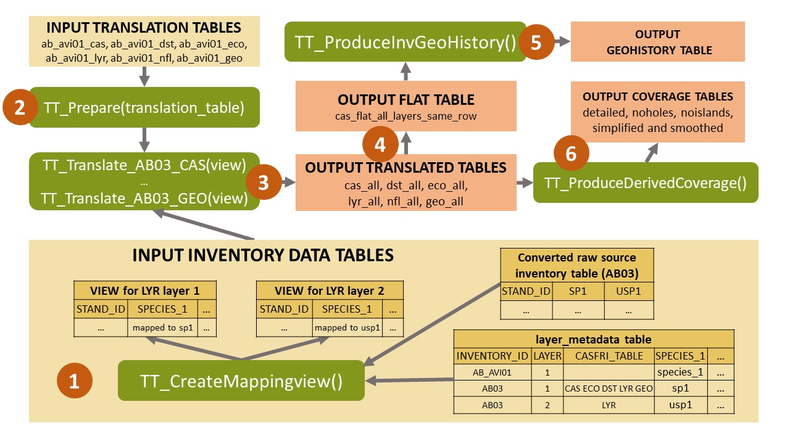
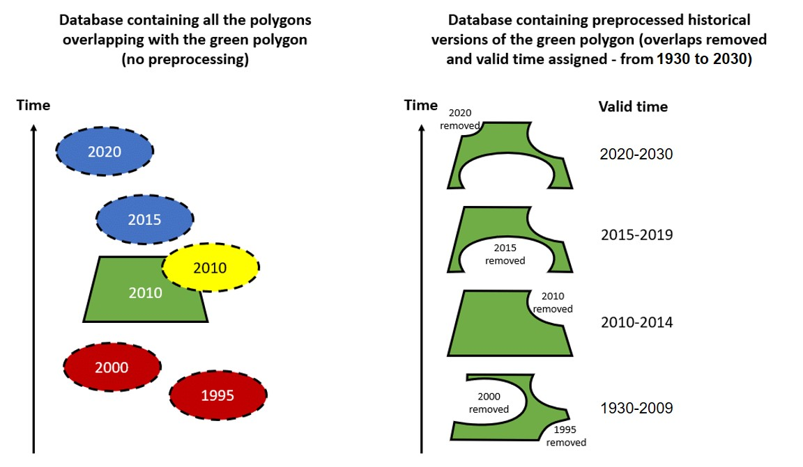

[](https://casfri.github.io/CASFRI/)

https://casfri.github.io/CASFRI/

# Introduction
Digital Forest Resource Inventories (FRIs) are compiled by provincial and territorial governments and are key inputs into forest management planning. They have also been used widely to model species habitat in the Canadian boreal forest and, in combination with climate and weather data, to model wildfire size and frequency. FRI datasets consist of stand records interpreted from aerial photography at scales ranging from 1:10,000 to 1:40,000. They are typically conducted on a 10- to 20-year cycle and may be periodically updated to reflect changes such as burned areas, harvesting, insect damage, silviculture, and forest growth. The records estimate the location, extent, condition, composition, and structure of the forest resource. Each jurisdiction has developed its own procedures and standards for forest inventories. 

The Common Attribute Schema for Forest Resource Inventories (CASFRI) harmonizes FRI data from each jurisdiction in Canada, allowing a national FRI relational database to be created with continuous coverage. CASFRI reconciles the many differences in variable formats, attributes, and standards among those disparate inventories. Harmonization allows models to be developed using data from multiple jurisdictions or inventory versions.

The [CASFRI specifications](https://github.com/CASFRI/CASFRI/tree/master/documentation/specifications) documents the CAS database schema. It focuses on the most common attributes that are consistently recorded in forest inventories across Canada and which are relevant to habitat modeling and state of forest reporting. These attributes include crown closure, species composition, height, mean canopy or stand origin age, stand structure, moisture regime, site class or site index, non-forested cover types, non-vegetated cover types, and disturbance history.

A number of CASFRI instances have been produced since 2009. CASFRI 5 is the fifth version of CASFRI. It introduces a number of significant updates to previous versions:

* A number of new and more up-to-date inventories.
* A new conversion and loading procedure based on the open source software GDAL/OGR (in place of ArcGIS).
* A new [SQL-based translation framework](https://github.com/CASFRI/PostgreSQL-Table-Translation-Framework) that abstracts translation logic away from SQL implementation details and centralizes it within dedicated translation tables.
* A temporalized version of the database resolving overlaps in space and time over the many inventories.
* A new descriptive error code system.

The three main steps involved in the production of the CASFRI database are:

1. **Conversion** (from many different FRI file formats) and loading (into a PostgreSQL database) using Bash scripts and ogr2ogr.
2. **Translation** of the raw loaded FRIs to the CASFRI schema inside PostgreSQL.
3. **Denormalization** of the normalized CASFRI tables into one flat table.
4. **Temporalization** of CAS data inside PostgreSQL.

Note that forest resource inventories are not provided with this project due to the numerous licensing agreements that have to be passed with the different production jurisdictions. Many provincial inventories are now openly distributed and can be downloaded for free from government web sites. It is the responsibility of the user to get and integrate those inventories into his CASFRI installation. All the inventories supported by CASFRI are documented in [the inventory_metadata.csv](https://github.com/CASFRI/CASFRI/blob/master/metadata/inventory_metadata.csv) table.

# Version Number Scheme

CASFRI follows the [Semantic Versioning 2.0.0](https://semver.org/) versioning scheme (major.minor.revision) adapted for a dataset. Increments in revision version numbers are for bug fixes. Increments in minor version numbers are for new features, support for new inventories, additions to the schema (new attributes), and bug fixes. Increments in minor versions should not break backward compatibility with code referring to the CASFRI schemas. Increments in major version numbers are for schema changes that break backward compatibility with existing code (e.g. renaming attributes, removing attributes, changing the structure of attribute values and inventory support deprecation).

The current version is 5.3.1 and is available for download at https://github.com/CASFRI/CASFRI/releases/tag/v5.3.1

# Directory Structure
<pre>
./                                      Sample files for configuring and running scripts

./conversion                            Bash scripts for converting and loading FRI datasets into PostgreSQL

./docs                                  GitHub enabled website

./documentation/specifications          CASFRI specifications document

./helperfunctions                       CASFRI specific helper functions used in translation tables

./helperfunctions/geohistory            Functions used to build the historical version of CASFRI

./metadata                              Main inventory and layer medadata files and loading script

./summary_statistics                    R scripts to summarize CASFRI output for validation checks

./translation/tables                    Translation tables and associated loading scripts

./translation/test                      Regression tests for CASFRI translations

./workflow/01_develTranslationTables    Translation scripts used for development and testing on sample versions of source tables

./workflow/02_produceCASFRI             Translation scripts to run all complete translations

./workflow/03_flatCASFRI                Scripts to build a flat (denormalized) version of CASFRI

./workflow/04_produceHistoricalTable    Scripts to build a historical version of CASFRI and for computing inventories coverage polygons
</pre>

# Requirements

The production process of CASFRI 5 requires:

* A Bash shell environment to control CASFRI command line .sh scripts. We use git-bash on Windows. Is should which come with every Git installation. We use the default Bash shell on Linux.

* GDAL v3.10.x. We use the [Conda package](https://anaconda.org/channels/conda-forge/packages/gdal/overview) on Windows and either the compiled or the APT package on Linux.

* PostgreSQL 13.1+ and PostGIS 3.1+ to store and translate the data (PostgreSQL 11/12 and PostGIS 2.3.x have also been tested). More recent versions should work as well.

* The [PostgreSQL Table Translation Framework](https://github.com/CASFRI/PostgreSQL-Table-Translation-Framework) to be able to write simple translation tables instead of writing SQL functions (in most cases).

# Vocabulary
**Source data -** Raw FRI data received from jurisdictions.

**Loaded source table -** Raw FRI data converted and loaded into PostgreSQL.

**Target table -** FRI table translated into the CASFRI specifications.

**Translation table -** User created table detailing the validation and translation rules and converted to SQL queries by the PostgreSQL Table Translation Framework.

**Lookup table -** User created table used in conjunction with the translation tables; for example, to recode provincial species lists to a standard set of 8-character codes.

**Translation framework -** The [PostgreSQL Table Translation Framework](https://github.com/CASFRI/PostgreSQL-Table-Translation-Framework).

**Helper function -** A set of PL/pgSQL functions used in the translation table to facilitate validation of source values and their translation to target values.

# FRI and Inventory Standard Identifiers
CASFRI 5 uses a four characters unique code named "inventory_id" to identify each FRI. This code is composed of two letters for the province or territory, and two numbers that increment for each new FRI added for that province/territory (e.g. BC01). Higher numbers do not necessarily imply more recent inventories. Sometimes newly acquired older inventories are added to the metadata table and are assigned a higher identifier.

Inventory standards define the attribute specifications (i.e., the data dictionary) used for a given inventory. Each jurisdiction has their own unique inventory standards. Multiple FRIs, from the same province or territory, can use the same standard. Jurisdictions occasionally update or redesign their standards, resulting in either a new version number or a markedly different standard. The CASFRI specifications need to apply different sets of translation rules for different standards. Each standard is assigned a code made of three letters identifying the standard, and two numbers identifying the version of the standard (e.g. VRI01). These codes are listed in the [inventory_metadata](https://github.com/CASFRI/CASFRI/blob/master/metadata/inventory_metadata.csv) table and used to name the translation tables and the translation functions.

# Handling Updates
Historical forestry data are highly valuable for forest research. For this reason, CASFRI accommodates both older inventories and subsequent updates. One common type of update in FRIs is re-inventories, in which legacy photo-interpretation data are revised to meet modern standards. Another type of update is the so-called "depletion updates" which compile newly identified disturbances. In many jurisdictions, depletion-updates are produced annually to "cut-in" polygons disturbed by harvesting, wildfire or insects activity.

Both types of updates are incorporated in CASFRI 5 by loading and translating the updated dataset and assigning it an incremented identifier (inventory_id). Any duplicate records are subsequently resolved through the temporalization procedure.

To be incorporated into the database, an update should have a publication date at least one year later than the previous version. When data are publicly available, this information can typically be found in the metadata.

# Conversion and Loading
Conversion and loading are performed simultaneously using the GDAL ogr2ogr tool. Each source FRI has it's own dedicated loading script that generates a single target table in PostgreSQL. If a source FRI consists of multiple files or multiple relational tables, the conversion/loading scripts append all files or tables into a single target flat database table, thereby eliminating schema complexity and facilitating translation. Some FRIs include an additional shapefile linking each stand to a photo year; these are loaded in the database using a separate script. 

Each loading script also adds two key attributes to the source table: "src_filename", containing the name of the source file, and "inventory_id", the unique inventory identifier. These attributes are subsequently used to construct the CAS_ID, a unique identifier that is also designed to be able to trace each translated row back to its original row in the source dataset.


### Supported File Types
All conversion/loading scripts are provided as .sh files invoking ogr2ogr, ogrinfo and/or psql commands.

Currently supported FRI formats are:

* Geodatabase
* Shapefile
* Arc/Info Binary Coverage

Arc/Info E00 files are not currently well supported by GDAL/OGR. Source tables in this format should be converted into a supported format using another software package before loading (e.g. to a file geodatabase).

### Projection
All source tables are transformed to the Canada Albers Equal Area Conic (ESRI:102001) projection by GDAL/OGR during loading.

### Configuration File
A config.sh file is required in the CASFRI root directory to define local paths and user-specific configuration variables. A template file, config_sample.sh, is provided and should be copied and modified to reflect the local environment.

### Source Data Folder Structure
Conversion and loading scripts are written so that FRIs to convert and load must be stored in a specific folder hierarchy (using inventory AB06 as an example):

FRI/  
├─AB/  
│ ├─AB06/  
│ │ ├─data/  
│ │ │ ├─archive/  
│ │ │ ├─coverage/  
│ │ │ ├─inventory/  
│ │ │ └─photoyear/  
│ │ ├─doc/  
│ │ │ ├─archive/  
│ │ │ ├─emailexchange/  
│ │ │ ├─manual/  
│ │ │ │ ├─others/  
│ │ │ └─map/  
│ │ ├─license/  
│ │ └─toclassify/  
│ └─AB16/  
│ │ ├─data/  
│ │ ├─doc/  
│ │ ├─.../  
├─BC/  
│ ├─.../  

# Translation
Translation of loaded source tables into target tables formatted to the CASFRI specification is done using the [PostgreSQL Table Translation Framework](https://github.com/CASFRI/PostgreSQL-Table-Translation-Framework). The translation framework uses a translation table that describes rules to validate each loaded source table and translate each row into the target table. Validation and translation rules are defined using a set of helper functions that both validate the source attributes and translate into the target attributes. For example, a function named isBetween() validates that the source data is within the expected range of values, and a function named mapText() maps a set of source literal values to a set of target values. A list of all helper functions is available in the [PostgreSQL Table Translation Framework README](https://github.com/CASFRI/PostgreSQL-Table-Translation-Framework). After the framework has processed all loaded source tables, the result is a complete set of target tables, each with matching attributes as defined by the CASFRI standard. 

### Translation Tables
A detailed description of the translation table structure is included in the [PostgreSQL Table Translation Framework README](https://github.com/CASFRI/PostgreSQL-Table-Translation-Framework). In short, each translation table lists the set of attribute names to be translated, their data type in the target table, a set of validation helper functions which all input values have to pass, and a set of translation helper functions to translate input values to CASFRI values. A set of generic helper functions are included with the [PostgreSQL Table Translation Framework](https://github.com/CASFRI/PostgreSQL-Table-Translation-Framework). They are used to perform common validations and translations in many different translation tables. The CASFRI project also has its own more specific set of [helper functions](https://github.com/CASFRI/CASFRI/tree/master/helperfunctions) that apply more complex translations specific to individual inventories.

CASFRI is composed of seven relational tables as detailed in the [CASFRI specifications](https://github.com/CASFRI/CASFRI/tree/master/documentation/specifications):
1. **Header (HDR) -** Summarizing reference information for each dataset;  
2. **CAS Base Polygon (CAS) -** Describing the source polygon and any identifiers;  
3. **Forest-Level (LYR) -** Describing productive and non-productive forest land;  
4. **Non-Forest Land (NFL) -** Describing non-forested land;  
5. **Disturbance history (DST) -** Describing the type, year and extent of disturbances;  
6. **Ecological specific (ECO) -** Describing wetlands;  
7. **Geometry attributes (GEO) -** Polygon geometries.

In general, each standard for each jurisdiction uses a single set of translation tables. All source datasets using the same standard should use the same set of translation tables. Differences in attribute names can be accommodated using the workflow scripts described below. In some cases minor differences in attributes between datasets using the same standard can be accommodated by designing translation helper functions that can deal with both formats. An example would be two datasets using the same standard, but different values for graminoids (e.g. 'Grm' in one dataset and 'graminoids' in another). These can be passed to a single translation function, dealing with all possible values, in the translation table (e.g. mapText(source_value, {'Grm', 'graminoids'}, {'GRAMINOID', 'GRAMINOID'})).

### Row Translation Rule
An important feature of the [PostgreSQL Table Translation Framework](https://github.com/CASFRI/PostgreSQL-Table-Translation-Framework) is the use of a ROW_TRANSLATION_RULE in the translation table to filter in only relevant source rows to be translated. This ensures that the LYR table for example, only includes rows that actually contain forest layer information.

### Error Codes
Error codes are needed during translation when source values are invalid, null, or missing. In CASFRI 5, error codes have been designed to match the attribute type and to reflect the type of error that was encountered. For example, an integer attribute will have error codes reported as integers (e.g. -8888) whereas text attributes will have errors reported as text (e.g. NULL_VALUE). Different error codes are reported depending on the rule being invalidated. A full description of possible error codes can be found in the [CASFRI specification](https://github.com/CASFRI/CASFRI/tree/master/documentation/specifications).

### Validating Translations
Validation is performed at multiple stages during and after translation:

* **Validation of translation tables by the translation framework** - The [PostgreSQL Table Translation Framework](https://github.com/CASFRI/PostgreSQL-Table-Translation-Framework) validates that translation tables are well formed prior to attempting translation.

* **Validation of source values** - All source values are validated by validations rules before attempting translation using the [PostgreSQL Table Translation Framework](https://github.com/CASFRI/PostgreSQL-Table-Translation-Framework) validation helper functions and/or the [CASFRI validation helper functions](https://github.com/CASFRI/CASFRI/blob/master/helperfunctions/helperFunctionsCASFRI.sql).

* **Validation of the translated CASFRI** - The [constraints](https://github.com/CASFRI/CASFRI/tree/master/workflow/02_produceCASFRI/03_ConstraintsChecksAndIndexes) scripts adds a set of database constraints to the translated tables. These constraints ensure that the translated data conform to the CASFRI standard as outlined in the [CASFRI 5 specification document](https://github.com/CASFRI/CASFRI/tree/master/documentation/specifications).

* **Overall review of translation tables** - The function TT_StackTranslationRules() creates a table of all translation and validation rules used for all inventories for a given CASFRI table. This allows visual review of all translation rules and assignment of error codes for a given attribute.

* **Validation of output using summary statistics** - The [summary_statistics](https://github.com/CASFRI/CASFRI/tree/master/summary_statistics) folder contains scripts (primarily summarize.R) to produce summary statistics for all attributes in each source inventory. These scripts use the R programming language and require that R be installed (https://www.r-project.org/). The output is a set of html files containing the summary information. These can be used to check for outliers, unexpected values, correct assignment of error codes etc.

### Workflow Scripts
The translation of each inventory dataset is done using the scripts in the [CASFRI/workflow/02_produceCASFRI/02_perInventory](https://github.com/CASFRI/CASFRI/tree/master/workflow/02_produceCASFRI/02_perInventory) folder. The translation process involves calling three functions:

* TT_Prepare() to validates and compile the translation table into a TT_TanslateXXX() function.
* TT_CreateMappingView() to create a VIEW mapping the raw inventory tables attribute names to the translation tables attribute names.
* TT_Translate_XXX() generated by TT_Prepare() to actually translate the values from the VIEW to the CASFRI tables.
  
TT_TranslateInventory() is a wrapper around those three functions. It is used by the workflow/02_produceCASFRI/02_translateAll.sh to translate each inventory. It can also be used directly by a user.

TT_Prepare() is part of the PostgreSQL Table Translation Framework. It is described in detail in the [PostgreSQL Table Translation Framework](https://github.com/CASFRI/PostgreSQL-Table-Translation-Framework) along with explanations on how to write translation tables. 

It is important to understand that a single translation table can be used for multiple translations, either for different layers within the same inventory, or for different inventories using the same standard but different attributes names. The workflow scripts accommodate this by combining three elements:

**1. Placeholder names in translation table helper functions -** Translation table helper functions use placeholder attribute names instead of actual source inventory attribute names. Every translation using a common translation table to translate similar inventories map inventory attribute names to these placeholder column names. That's how a single translation table can be reused to translate many inventories from the same jurisdiction. Otherwise many translation tables using the same helper functions but with different attribute names would have to be created. In the workflow script, VIEWs are created to map the source inventory attribute names to the placeholder attribute names found in the translation table. One can then run the same translation using as many different VIEWs as there are inventories and layers.

**2. layer_metadata table -** This table defines the mapping of attributes from each source table layers to the placeholder names used in the translation tables. For each translation table, the layer_metadata table contains a row listing the translation table placeholder names, and rows for each translation that needs to be completed using the source inventory. If multiple LYR, DST or NFL layers have to be translated for an inventory, multiple rows are defined in the layer_metadata table. This table has the following columns:

* **INVENTORY_ID -** either identifies a translation table (e.g. AB_AVI01) or a source inventory from which to match the attribute names (e.g. AB03).
* **LAYER -** a unique integer value incrementing for LYR layers followed by NFL layers.
* **CASFRI_TABLE -** identifies the CASFRI tables (cas, eco, dst, lyr, nfl) that are translated using each particular layer number.
* **TTABLE_EXISTS -** indicates if the row represents the placeholder names of an existing translation table or only the source inventory attribute names for which no actual translation table exists.

All the other columns represent target attributes in the CASFRI tables. The values in each cell list the attributes to be mapped to the translation table placeholder attribute names. In the case of the translation table rows, the values must match the placeholder names used in the translation table. In the case of rows representing source datasets, the values must match source (raw) attribute names.

**3. TT_CreateMappingView() -** This function is used to create the VIEWs mapping the raw inventory tables attribute names to the translation tables placeholder names according to the mapping found in the layer_metadata table. TT_CreateMappingView() is also used to create random selections of source rows for development or testing purpose. It takes the following arguments:

* **schemaName -** name of the schema the source inventory was loaded to.
* **fromTableName -** identifier of the source inventory in the layer_metadata table (inventory_id) from which to map the attribute names.
* **fromLayer (default to 1) -** matches the LAYER column in the layer_metadata table.
* **toTableName (default to fromTableName) -** identifier of the translation standard in the layer_metadata table to which to map the attribute names (prefixed with the jurisdiction code. e.g. "bc_vri01").
* **toLayer (default to 1) -** matches the LAYER column in the layer_metadata table (for our purposes this is always set to 1).
* **randomNb (default to all rows) -** number of random rows to select. If blank, all rows are selected.
* **viewNameSuffix (default to "")-** suffix to give to the VIEW created.

The function creates a VIEW with a name based on the input arguments:

* If only 'fromTableName' is provided, a VIEW with only the mapped set of attributes is created (without mappings). For example `SELECT TT_CreateMappingView('rawfri', 'ab03', 200);` creates a VIEW named **ab03_min_200** in the **rawfri** schema listing only the attributes listed for the first layer of AB03.

* If both 'fromTableName' and 'toTableName' are provided without 'fromLayer' and 'toLayer', the 'fromTableName' attribute names of layer 1 are mapped to the 'toTableName' attribute names of layer 1 (i.e. the translation table placeholder names). For exampe `SELECT TT_CreateMappingView('rawfri', 'ab03', 'ab_avi01');` creates a VIEW named **ab03_l1_to_ab_avi01_l1_map** in the **rawfri** schema.

* When 'fromLayer' and 'toLayer' integers are provided, the row corresponding to the provided layer numbers will be used for the mapping. For example `SELECT TT_CreateMappingView('rawfri', 'ab03', 2, 'ab_avi01', 1);` creates a VIEW named **ab03_l2_to_ab_avi01_l1_map** in the **rawfri** schema.

* When 'randomNb' is provided, the VIEW produces that number of randomly selected rows and the VIEW name is suffixed with that same number. For example `SELECT TT_CreateMappingView('rawfri', 'ab03', 2, 'ab_avi01', 1, 200);` creates a VIEW named **ab03_l2_to_ab_avi01_l1_map_200** in the **rawfri** schema.

The following diagram illustrates, using a simple attribute (SPECIES_1), how:

1. The layer_metadata table is used by the TT_CreateMappingView() function to produce VIEWs on the different layers of forest data from the converted raw source inventory tables.
2. The TT_Prepare() function uses the translation tables to produce input-agnostic TT_Translate_XX00_YYY() translation functions.
3. The TT_Translate_XX00_YYY() functions use data from the VIEWs to produce the six CASFRI translated tables (cas_all, dst_all, eco_all, lyr_all, nfl_all and geo_all).
   
Validation and translation rules in the translation tables always use the same VIEWs attribute names when reused to translate different versions of the same inventory or different layers within that inventory. The VIEWs, which map the different source data names to those used in the translation tables, allow the same translation table to be reused for multiple inventories and layers avoiding lots of code duplication.

Each inventory and each layer is translated by a different query using the proper VIEW. For the layer 1 translation, the source attribute SP1 is mapped to the placeholder name (SPECIES_1). For the layer 2 translation, the understory attribute usp1 is also mapped to the same placeholder name (SPECIES_1) because the logic for translating layer 1 and layer 2 are the same.

The diagram also shows how :

1. The CASFRI translated tables are denormalized to a flat table including the two first layers in the same row.
2. The GeoHistory table is produced from the flat table with TT_ProduceInvGeoHistory().
3. The coverage polygons of all inventories are produced with TT_ProduceDerivedCoverage()




# Translation Procedure
The steps to produce a complete build of the CASFRI database are detailed in the [release procedure](https://github.com/CASFRI/CASFRI/blob/master/documentation/release_procedure.md). A subset of these steps can be used to translate a single dataset as follows:

1. **Create anew PostgreSQL database** and make sure to CREATE the PostGIS extension in it.
2. **Configure** your processing environment in the config.sh file.
3. **Load the inventory** (e.g. AB03) into PostgreSQL by executing the conversion/sh/load_ab03.sh loading script in a Bash shell. If you are building CASFRI with many inventories, you should look at how to launch many conversions in parallel in the Parallelization section of this document.
4. **Load the translation tables** into PostgreSQL with the translation/load_tables.sh script.
5. **Install the PostgreSQL Table Translation Framework and the CASFRI Helper Functions**
    1. Install the last version of the PostgreSQL Table Translation Framework extension file using the install.sh script. This produces a file named table_translation_framework--x.y.z.sql in the Postgresql/XX/share/extension folder.
    2. In pgAdmin or using the psql client, CREATE the Table Translation Framework extension (the same way you did for PostGIS) and test it using the engineTest.sql, helperFunctionsTest.sql and helperFunctionsGISTest.sql scripts.
    3. In pgAdmin or using the psql client, execute the CASFRI Helper Functions helperFunctionsCASFRI.sql script and test the functions with helperFunctionsCASFRITest.sql.
6. **Run the translation** either by invoking the TT_Prepare(), the TT_CreateMappingview() and the TT_Translate_XXX() function created by TT_Prepare() in the right order and with the proper parameters or simply SELECT TT_TranslateInventory('AB03') which encapsulate the three previous functions into a single call. If you are building CASFRI with many inventories, you should look at how to launch many translation in parallel in the Parallelization section of this document.

The whole process assume that:

1. There is a row for each inventory in the metadata/inventory_metadata.csv table.
2. There is, in the translation/tables folder, a set of translation tables CSV files associated with the inventory and that these files named properly with the jurisdiction of the inventory, the standard id matching the one found in the STANDARD_ID column of the metadata/inventory_metadata.csv table and the cas table they are supposed to translate. E.g. bc_vri01_dst.csv
3. There is a row for each layer to be translated in the metadata/layer_metadata.csv table with the INVENTORY_ID column of the first row matching the concatenation of the jurisdiction and the proper STANDARD_ID. E.g. BC_VRI01
4. Each cas table to be translated is listed the proper layer row of the CASFRI_TABLE column of the same metadata/layer_metadata.csv table.
5. All source inventory attribute names have been mapped properly to the placeholder attribute names in the same metadata/layer_metadata.csv table.

Translated data is INSERTed to the six CASFRI output tables in the 'casfri50' schema: cas_all, dst_all, eco_all, lyr_all, nfl_all, geo_all. The scripts in the [CASFRI/workflow/03_flatCASFRI/](https://github.com/CASFRI/CASFRI/tree/master/workflow/03_flatCASFRI) folder can be used to create two different denormalized tables of the six CASFRI tables: one with all layers for a given polygon reported on the same row, and one with all layers for a given polygon reported on different rows. The former is used to generate the historical version of the CASFRI database.

The steps to add a completey new inventory to the CASFRI database are detailed in issue [#471](https://github.com/CASFRI/CASFRI/issues/471).

# CASFRI Historical Table
The six tables found in the 'casfri50' schema as the result of a complete translation gathers stands from many inventories, where polygons sometimes overlap each other in space or/and time (e.g. BC08, BC10 and BC11). That means if you try to match an observation point made at a specific year, you might end up with more than one matching stand. Either because they overlap in space (some inventories have many polygons of the same year overlapping each other), in time (the valid time of one inventory (e.g. 2000-2010) overlaps the valid time of the following inventory (2008-2015)) or both.

The historical version of the CASFRI database introduces a new geometry table, replacing the "geo_all" table, in which no two polygons occupy the same space at a given point in time (i.e. no two polygons overlap in space and time). In this table, stand polygons are cut so that only polygons parts from the most accurate inventory at the date of observation can be matched. It allows querying for the best available inventory information at any point in time accross the full CASFRI coverage.

The historical table is created using the scripts found in the workflow/04_produceHistoricalTable folder. The .sh script are to be used to run the process for multiple inventories in parallel from the Bash shell and the .sql script are to be used from pgAdmin or psql with more control over the process. These scripts are:

* **01_PrepareGeoHistory.sh and 01_PrepareGeoHistory.sql** overwrite the default TT_RowIsValid() and TT_HasPrecedence() functions, create the geo_history table and split the whole CASFRI geometry coverage into a grid for easier spatial processing.

* **02_ProduceGeoHistory.sh and 02_ProduceGeoHistory.sql** process each gridded polygon one by one. The algorithm uses the STAND_PHOTO_YEAR of each polygon as the reference date to determine its valid start and end year. Each polyon is intersected with all other overlapping polygons and the resulting polygon parts are assigned a VALID_YEAR_BEGIN and a VALID_YEAR_END value. In the case of overlaps, the polygon with the most complete and accurate information is prioritized as described below. Both scripts use the TT_ProduceInvGeoHistory() function.

* **03_ProduceInventoryCoverages.sh and 03_ProduceInventoryCoverages.sql** produce a set of tables containing different versions of coverage polygons for each inventory. Both scripts use the TT_SuperUnion() and the TT_ProduceDerivedCoverages() functions.

The following diagram illustrates the temporalization procedure for a single polygon:



Valid start and end dates are assigned using the following rules:
* Each polygon is assigned a VALID_YEAR_BEGIN and a VALID_YEAR_END based on its CAS table STAND_PHOTO_YEAR attribute value. By default, at the end of the process, if a polygon does not overlap with another one in space and time, VALID_YEAR_BEGIN is assigned 1930 and VALID_YEAR_END is assigned 2030 since this polygon and its associated attributes are the best information we have for this area for all this period of time.
  
* When two polygons overlap:

  * More recent polygons take precedence over older polygons starting at their VALID_YEAR_BEGIN year. For example, a polygon from 2010 takes precedence over a 2000 polygon starting in year 2010. The 2000 polygon has precedence from 1930 until 2009 and the 2010 polygon has precedence from 2010 to 2030.
  * When both polygons have the same STAND_PHOTO_YEAR, the polygon with valid values takes precedence over polygons with invalid values. Invalid values are defined as all significant CASFRI attributes being NULL or empty. This rarely happens, but if it does, the polygon with valid values takes precedence.
  * When both polygons have the same STAND_PHOTO_YEAR and valid values but come from different inventories, the polygon from the higher precedence inventory, as established by the TT_HasPrecedence() function and the PRECEDENCE_RANK column of the inventory_metadata.csv table, takes precedence. For example, if the values associated to two overlapping 2010 polygons are all valid but the first polygon comes from AB10 and the second comes from AB16, then TT_HasPrecedence() states that the AB16 polygon takes precedence.
  * When both polygons have the same STAND_PHOTO_YEAR, valid values and the same TT_HasPrecedence() rank, then both polygons are sorted by their unique identifier (CAS_ID) and the first one has precedence over the second one.

No interpolation, interpretation or correction of attribute values is performed when generating the historical table. For this reason the historical table can be queried to recreate the 'state of the inventory' for a given year, but not necessarily the 'state of the forest'. The 'state of the inventory' is the best available information for a given point in time, whereas the 'state of the forest' would require assigning the best forest attributes for every year based on time since disturbance considering all the information found in the numerous historic inventories. This is beyond the scope of this project, but the historical table could facilitate such modelling exercises for interested end users.

The historical table can be queried using VALID_YEAR_BEGIN and VALID_YEAR_END. For example, the following query would select the most valid polygon from the historical table for all observation points in a table:
```
SELECT p.id, p.year, p.geom, gh.cas_id
FROM mypointable p, casfri50_history.geo_history gh
WHERE ST_Intersects(gh.geom, p.geom) AND gh.valid_year_begin <= p.year AND p.year <= gh.valid_year_end;
```
The resulting table can then be joined, using the CAS_id attribute, with:

  a) one of the two flat tables from the casfri50_flat schema or
  b) one of the CASFRI normalized tables from the casfri50 schema (cas_all, dst_all, eco_all, lyr_all, nfl_all).

# Parallelization
Conversion, translation, production of the historical table and production of the inventory coverages are all very long processes when translating many inventories. In its current state, with more than 50 inventories supported, the final cas_all table gathers more than 66 million stands. If you include the other CASFRI tables (eco_all, dst_all, lyr_all, nfl_all and geo_all) that's more than 225 million rows translated. If you multiply this by the number of attributes composing each CASFRI table you get more than 3 billion values to translate. Even for a powerful database management system like PostgreSQL, that's a lot of information to process.

Much effort have been deployed during the development of CASFRI 5 to make this process as quick and efficient as possible. Moving from PostgreSQL 11 to PostgreSQL 13 and from PostGIS 2.5 to PostGIS 3.1 has been a good step in this regard. PostgreSQL 13 and up provide much better support for PARALLEL SAFE functions and PostGIS 3.1 uses the new faster GEOS 3.9 geometry library.

On the CASFRI side, all steps involving long processes have been designed so they don't block each other as it is often the case in a DBMS like PostgreSQL. You can run each process as SQL scripts to have better monitoring and debugging control, or you can batch run them all in parallel using Bash shell scripts. Those scripts will launch one new sub processing shell for each inventory to process.

The first step to implement parallel batch processing is to define the list of inventories to translate by assigning 'YES' or 'NO' in the TRANSLATED_BY_XXX column of the metadata/inventory_metadata.csv table for each inventory. You must then set the "metadataTableLoadingColumn" variable to the name of this column in the config.sh configuration file. You can also add your own custom TRANSLATED_BY_CUSTOM column in the inventory_metadata table. This file will be loaded in PostgreSQL and it will be used to define the "invList" variable for the .sh processing scripts.

Another way to define the list of inventory to process and hence the "invList" variable, is to set this variable directly in the config.sh configuration file. If it's set there, the TRANSLATED_BY_XXX column in the inventory_metadata.csv will be ignored.

TRANSLATED_BY_XXX is useful to define a definitive list of inventory to process. Setting "invList" in the config file is useful when some inventories listed in TRANSLATED_BY_XXX fails to process and you want to give them a second try.

You can also pass the names of a couple of inventories to process as parameters to most .sh processing scripts.

The next step is to set the "maxConversionInParallel", "maxTranslationsInParallel" and "maxGeoHistoryInParallel" to set the number of parallel sub process shells you want to run at the same time. This should be set according to the number of cores present on your machine. "maxConversionInParallel" and "maxGeoHistoryInParallel" are lower than "maxTranslationsInParallel" because they involve more IO operations and computation. When one sub process finishes, it closes by itself and a new one is automatically launched up to the "maxXXXInParallel" defined for each kind of process.

If you want to debug a problematic sub process script and see the error message in the sub process shell, you can set the proper "leaveXXXShellOpen" variable to control the automatic closing of the sub processing shells.

Once the metadata/inventory_metadata.csv has been edited and the proper variables have been set in config.sh, you can launch the different processing scripts in the right order to 1) convert, 2) test, 3) translate, 4) produce the geohistory table and 5) produce the inventory coverages. Here is a description of those scripts:

1. ./conversion/**convert_all.sh** loads all the source inventories listed in the "invList" variable (set by the) into the PostgreSQL schema defined by the "targetFRISchema" variable in the configuration script (config.sh).

2. ./translation/test/**test_translation.sh** runs translation tables on subsets of source inventories using the TT_RunAllTests() SQL function. The resulting tables are to be compared with archived tables for desired or undesired differences. This quick check is to make sure everything works as expected before launching the main, long translation process. This is also used to make sure nothing is broken when developping new features or fixing issues. The resulting tables are written to the casfri50_test schema. The whole translation test process is explained in the [CASFRI/translation
/test/readme.md](https://github.com/CASFRI/CASFRI/blob/master/translation/test/readme.md) document.

1. ./workflow/02_produceCASFRI/**01_createCASFRITables.sh** prepares the database for the main translation process.

2. ./workflow/02_produceCASFRI/**02_translateAll.sh** is the main translation script. It will translate all the source inventories listed in the "invList" variable to the casfri50 schema tables using by calling the TT_TranslateInventory() SQL function.

3. ./workflow/03_flatCASFRI/**01_all_layers_same_row.sh** and ./workflow/03_flatCASFRI/**03_one_layer_per_row.sh** are used to produce the flat, denormalized VIEW versions of the translated tables. The resulting VIEWs are written to the casfri50_flat schema as MATERIALIZED VIEWs.

4. ./workflow/04_produceHistoricalTable/**01_PrepareGeoHistory.sh** prepares the database before launching the historical table production process. It will create the target table and split the whole geometric coverage into a grid for faster and more robust processing. The functions required by this process have first to be defined in the database by executing the ./helperfunctions/geohistory/geohistory.sql before running 01_PrepareGeoHistory.sh.

5. ./workflow/04_produceHistoricalTable/**02_ProduceGeoHistory.sh** generates the historical table based on the "invList" variable using the TT_ProduceInvGeoHistory() SQL function. The resulting tables are written to the casfri50_history schema.

6. ./workflow/04_produceHistoricalTable/**03_ProduceInventoryCoverages.sh** generates a set of tables with the inventories geographic coverage polygons simplified at different levels using the TT_ProduceDerivedCoverages() SQL function. The resulting tables are written to the casfri50_coverage schema.

There is still much work to do to optimize the speed of many helper functions and to make them PARALLEL SAFE so that not only different inventories are processed on different CPUs (on the same machine) but individual inventory processing is also split across many CPUs (still on the same machine). It is quite difficult to write pl/pgSQL parallel functions that are also able to display some progress. Showing progress and feedback has been privileged over parallel processing for individual inventories. No real work has been done to split those processes across multiple machines.

# Update Procedure
The [update procedure](https://github.com/CASFRI/CASFRI/blob/master/documentation/inventory_update_procedure.md) is the method for incorporating new datasets without having to regenerate the whole CASFRI database. New datasets could be an entirely new inventory, or a partial inventory or depletion update.

An alternative method would be to rerun the full translation from scratch using the steps documented in this document or in the [release procedure](https://github.com/CASFRI/CASFRI/blob/master/documentation/release_procedure.md).


# Credits
**Steve Cumming**, Center for Forest Research, University Laval.

**Pierre Racine**, Center for Forest Research, University Laval.

**Marc Edwards**, database design, programming.

**Pierre Vernier**, FRI translations.

**Mélina Houle**, Center for Forest Research, University Laval.

**Morgan Thompson**, Canadian Forest Service. 

**John Cosco**, Timberline Forest Inventory Consultants (previous versions of CASFRI).

**Bénédicte Kenmei**, Center for Forest Research, University Laval (previous versions of CASFRI).

# Citation
Cumming, S.G., Racine, P., Edwards, M., Houle, M., Vernier, P., Thompson, M., Cosco, J. and Kenmei, B. (2021). Common Attribute Schema for Forest Resource Inventories (CASFRI). Université Laval, QC, Canada. URL https://casfri.github.io/CASFRI/.
