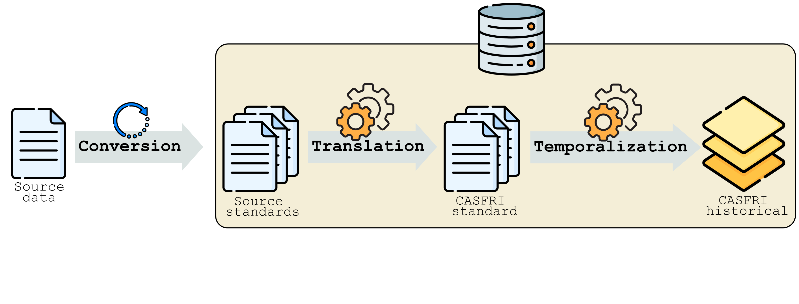

# Introduction

Digital Forest Resource Inventories (FRI) are the primary forest management planning tool used in Canada. They have also proved useful in ecological modelling applications related to songbirds, waterfowl, woodland caribou, fire ecology, stand dynamics and conservation planning. FRI stand maps estimate the location, extent, condition, composition, and structure of the forest resource. Many FRIs also include information on disturbances, non-forest components, and in some cases wetland categorizations. 

FRI data exist for most of Canada’s managed forest lands, but are scattered among many owners, private and crown, adhere to many different standards, are of widely varying age, and are subject to periodic updates and re-inventories. These features challenge their wide-spread use in applied research, especially over large spatial extents spanning jurisdictions and inventory standards.

The goal of the CASFRI project is to pass each FRI dataset from the various jurisdictions across Canada through a <a target="_blank" rel="noopener noreferrer" href="https://github.com/edwardsmarc/PostgreSQL-Table-Translation-Framework">translation engine</a>. The translation engine converts each dataset into the CASFRI specifications and merges the datasets together to create a continuous map of FRI polygons. CASFRI uses a standardized specification focused on attributes that are: 1) most commonly and consistently recorded among existing inventories and 2) most relevant to ecological modelling and forest management planning. 

For example, the image below represents a white spruce forest and a fire crossing between two jurisdictions on either side of a river. Each jurisdiction records the species content of the forest and the year and type of disturbance using different formats. The job of CASFRI is to translate each of these into a common format.

{width=75%}

 

There is no other existing accessible, comprehensive repository for Canada's FRI data. CASFRI secures historic FRIs for the use of present and future research needs. We expect the value to increase with the passage of time, as new inventories are added to a historical record that now spans more than 30 years.

All CASFRI data are inherantly spatial, because all attributes are directly associated with a specific polygon. No sample plots or point data are processed by CASFRI. CASFRI therefore produces continuous maps of FRI polygons matching the extent of the input data. CASFRI does not model or interpolate data, the CASFRI philosophy is to translate the source data into the CASFRI specification as directly and transparently as possible. Users interested in modelling, projecting or interpolating data can use the CASFRI database as a starting point for their analysis, or they can modify the CASFRI workflow to create their own standardized forest inventory conforming to their own specifications.

CASFRI ensures reliable and robust data by applying validation procedures at multiple stages in the workflow. Input data are validated before any translation is attempted. The translation rules themselves are then validated prior to data translation. The final CASFRI database is validated to ensure all data conform to the CASFRI specifications. Any invalid data is reported using the CASFRI <a target="_blank" rel="noopener noreferrer" href="https://github.com/edwardsmarc/CASFRI/tree/master/documentation/specifications#Error_codes">error code syntax</a> which informs users on the type of invalidation that occurred.

 

# CASFRI specifications
The <a target="_blank" rel="noopener noreferrer" href="https://github.com/edwardsmarc/CASFRI/tree/master/documentation/specifications">CASFRI specifications</a> define the format of the data stored in CASFRI. The goal of these specifications is to represent all the various data formats from jurisdictions across Canada. CASFRI stores data in seven different tables:

{width=100%}

Each table is described in detail in the <a target="_blank" rel="noopener noreferrer" href="https://github.com/edwardsmarc/CASFRI/tree/master/documentation/specifications">CASFRI specifications</a>.
 
 
 

# Building CASFRI
There are three main steps to build the CASFRI dataset. The first is **Conversion** where the source FRI data are loaded into the database. Once inside the database the source FRI is **Translated** to the CASFRI specifications. Finally, once all FRIs have been translated they are combined to create the historical dataset in the **Temporalization** step.

{width=75%}

{height=50px} 
CASFRI uses an Extract, Load, Transform (ELT) workflow where source data is first loaded into the PostgreSQL database, then translated inside the database. The first step in building CASFRI is therefore to load the source FRI data into the PostgreSQL database using a loading script. Each source FRI dataset has its own <a target="_blank" rel="noopener noreferrer" href="https://github.com/edwardsmarc/CASFRI/tree/master/conversion/sh">loading script</a>. Loading is done using GDAL, supported formats are ESRI geodatabases, shapefiles and Arc/Info Binary Coverages.

{height=50px} 
After the conversion step, the source inventories are stored inside the PostgreSQL database, but they are still formatted to their original specifications. The next step is to translate them into the CASFRI specifications. For this we use the <a target="_blank" rel="noopener noreferrer" href="https://github.com/edwardsmarc/PostgreSQL-Table-Translation-Framework">PostgreSQL table translation framework</a>. This translation engine allows the source data to be translated into the CASFRI attributes satisfying the CASFRI specifications. The translation rules are defined in a simple csv table (one for each CASFRI table) using a set of helper functions to validate and translate the source values into the CASFRI values. The csv <a target="_blank" rel="noopener noreferrer" href="https://github.com/edwardsmarc/CASFRI/tree/master/translation/tables">translation tables</a> form an important piece of documentation because in addition to providing the translation engine with the rules and parameters for each translation, they also serve to document and describe the translation from source value to CASFRI value for every CASFRI attribute and every source dataset. The translation tables also define the specification of the final CASFRI database and are themselves validated by the translation engine before any translations are attempted. Multiple source datasets can be translated using the same translation table if they conform to the same standard. At the end of the translation step, the PostgreSQL database contains every valid source polygon, translated into the CASFRI specifications.

{height=50px} 
The final step is to use the translated data to build the historical database. This process is described in detail on the <a target="_blank" rel="noopener noreferrer" href="https://github.com/edwardsmarc/CASFRI">CASFRI github page</a> and involves intersecting all overlapping polygons, selecting the best data when polygons overlap in time, and assigning a valid date range for all resulting polygons. The final historical database can then be queried to find the most relavent FRI attributes for any given time, at any requested location. The historical database does not project or interpolate forest attributes through time, it simply returns the best available FRI information for a given year. It is up to the user to do any interpolation or modelling on the output data.
 
 
 

# How to cite the project

Please use the following citations when referencing the CASFRI project and the PostgreSQL-Table-Translation-Framework:

CASFRI Project Team (2021). Common Attribute Schema for Forest Resource Inventories. Université Laval, QC, Canada. URL https://casfri.github.io/CASFRI/. DOI: 10.5281/zenodo.5212880

CASFRI Project Team (2021). PostgreSQL Table Translation Framework. Université Laval, QC, Canada. URL https://github.com/CASFRI/PostgreSQL-Table-Translation-Framework. DOI: 10.5281/zenodo.5212132
