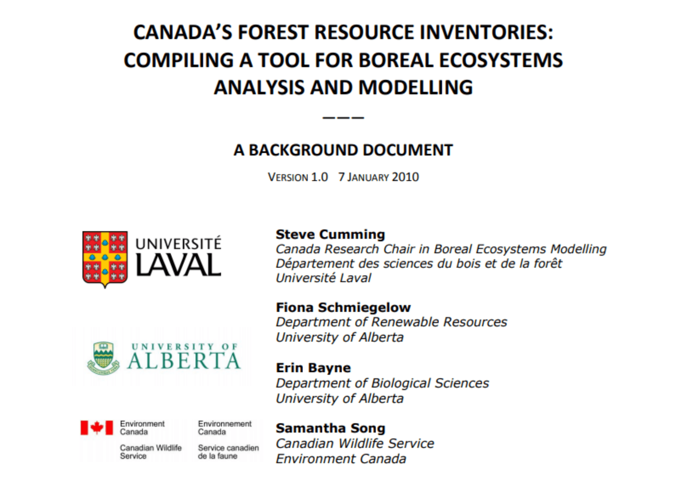
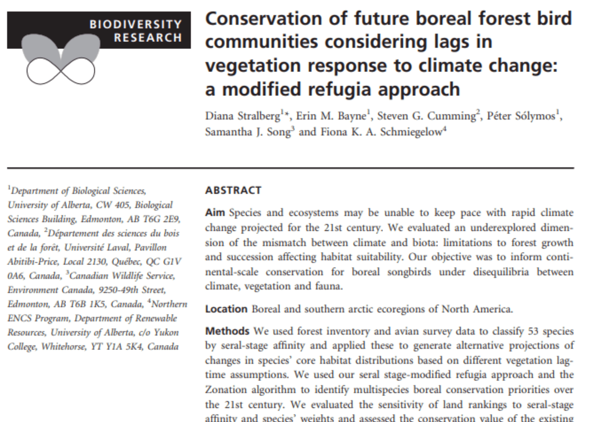

# Projects and Publications
The following projects and publications are examples of CASFRI in action!

<!--html_preserve-->

  

    
Projects

    
CASFRI has been used in a range of projects requiring continuous coverage of forest attributes.

    

      
      

        
        <a target="_blank" rel="noopener noreferrer" href="https://borealbirds.ualberta.ca/" class="projectItemLabel">The Boreal Avian Modelling Project</a>
        
The BAM project has used CASFRI to model bird density and habitat associations using continuous coverages of forest attributes across the Canadian boreal.

      

      
      

        
        <a target="_blank" rel="noopener noreferrer" href="https://nfi.nfis.org/en/" class="projectItemLabel">Canada's National Forest Inventory</a>
        
The NFI has applied the CASFRI framework to develop an ongoing historical database of Canada's forests.

      

    

  

  

    
Publications

    
The following is a list of publications using CASFRI.

    

      
      

        
        <a target="_blank" rel="noopener noreferrer" href="http://www.cef.ulaval.ca/uploads/Membres/CAS_Backgrounder_v1.0.pdf" class="projectItemLabel">CASFRI backgrounder document</a>
        
A backgrounder document from 2010 describing the origins of CASFRI and it's development for use in natinoal scale wildlife modelling.

      

      
      

        
        <a target="_blank" rel="noopener noreferrer" href="https://cdnsciencepub.com/doi/abs/10.1139/cjfr-2014-0102" class="projectItemLabel">Cumming et al. 2015</a>
        
Cumming et al. 2015 used CASFRI to conduct a gap analysis of tree species representation in Canada's protected area network.

      

      
      

        
        <a target="_blank" rel="noopener noreferrer" href="https://onlinelibrary.wiley.com/doi/full/10.1111/ddi.12356" class="projectItemLabel">Stralberg et al. 2015</a>
        
Stralberg et al. 2015 used CASFRI to evaluate the effect that limited forest growth and succession under climate change will have on forest bird habitat suitability.

      

      
      

        
        <a target="_blank" rel="noopener noreferrer" href="https://onlinelibrary.wiley.com/doi/pdf/10.1111/ddi.12991" class="projectItemLabel">Crosby et al. 2019</a>
        
Crosby et al. 2019 used CASFRI to test for differential habitat selection in boreal songbirds.

      

      
      

        
        <a target="_blank" rel="noopener noreferrer" href="https://cbmjournal.biomedcentral.com/articles/10.1186/s13021-016-0065-6" class="projectItemLabel">Boisvenue et al. 2016</a>
        
Boisvenue et al 2016 used CASFRI along with satellite data to estimate greehouse gas emissions and removals at a 30m resolution.

      

      
      

        
        <a target="_blank" rel="noopener noreferrer" href="https://www.sciencedirect.com/science/article/abs/pii/S037811271630319X" class="projectItemLabel">Boisvenue et al. 2016</a>
        
Boisvenue et al 2016 used CASFRI, field plot data, and Landsat data to estimate forest growth over time.

      

      
    

  

 

    
Ongoing projects

<!--/html_preserve-->
 

* Estimating the Historical Range of Variation in forest songbird abundances within managed forests of Alberta, Ontario and Quebec. PhD thesis project. Ana Raymundo Sanchez, supervised by Cumming.

* Downscaling national models of songbird density to inform forest management planning. PhD thesis project. Isolde Lane-Shaw, supervised by Cumming.

* Evaluating two data sources to initialize vegetation state of forest dynamics models: 1) the Forest Inventory non-parametric K-nearest neighbors procedure (kNN), and 2)  the Common Attribute schema for Forest Resource Inventory Data (Raymundo-Sanchez, Lane-Shaw, Cumming and others).

* Changes in age structure and tree-species composition of managed boreal forests in western Canada: 1990-2020. A new collaboration between the Cumming lab and CWS.
