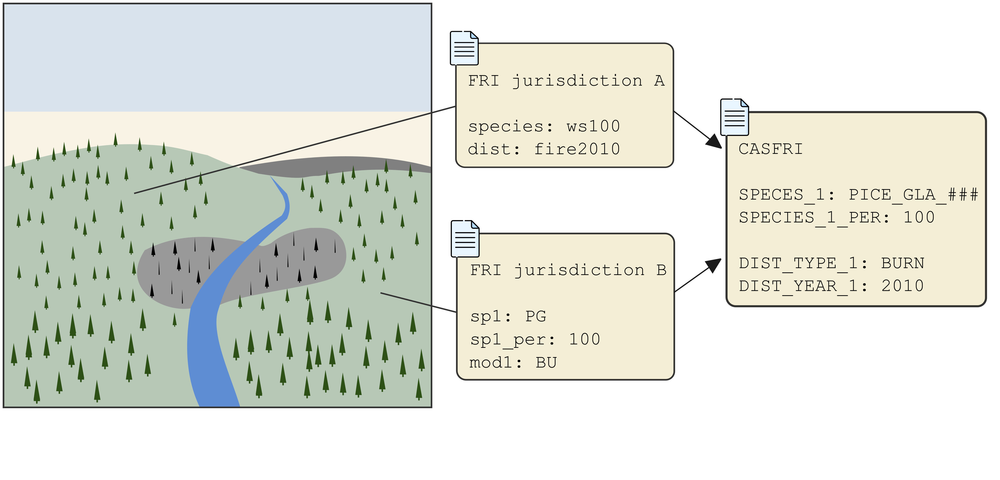
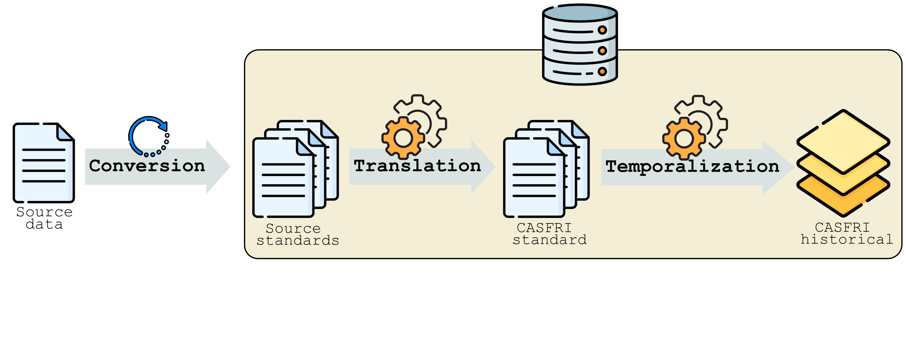

---
output:
  html_document:
    toc: false
    toc_float: false
---

# Introduction
Digital Forest Resource Inventories (FRIs) are compiled by provincial and territorial governments and are key inputs into forest management planning. FRI datasets consist of stand maps interpreted from aerial photography at scales ranging from 1:10,000 to 1:40,000. The stand maps estimate the location, extent, condition, composition, and structure of the forest resource. Many FRIs also include information on disturbances such as fire, windthrow and insects, non-forest components such as understory vegetation, non-vegetated land and anthropogenic land use, and in some cases wetland categorizations. Each jurisdiction has developed its own procedures and standards for forest inventories making it difficult to assemble datasets across multiple jurisdictions.

The goal of the CASFRI project is to pass each FRI dataset from the various jurisdictions across Canada through a [translation engine](https://github.com/edwardsmarc/PostgreSQL-Table-Translation-Framework). The translation engine converts each dataset into the CASFRI specifications and merges the datasets together to create a continuous map of FRI polygons. For example, the image below represents a white spruce forest and a fire crossing between two jurisdictions on either side of a river. Each jurisdiction records the species content of the forest and the year and type of disturbance using different formats. The job of CASFRI is to translate each of these into a common format.

{width=75%}

# CASFRI specifications
The [CASFRI specifications](https://github.com/edwardsmarc/CASFRI/tree/master/docs/specifications) define the format of the data stored in CASFRI. These specifications need to represent all the various data formats from jurisdictions across Canada. CASFRI stores data in seven different tables:

{width=100%}

Each table is described in detail in the [specifications document](https://github.com/edwardsmarc/CASFRI/tree/master/docs/specifications).
 
 
 

# Building CASFRI
There are three main steps to build the CASFRI dataset. The first is **Conversion** where the source FRI data are loaded into the database. Once inside the database the source FRI is **Translated** to the CASFRI specifications. Finally, once all FRIs have been translated they are combined to create the historical dataset in the **Temporalization** step.

{width=75%}

{height=50px} 
CASFRI uses an Extract, Load, Transform (ELT) workflow where source data is first loaded into the PostgreSQL database, then translated inside the database. The first step in building CASFRI is therefore to load the source FRI data into the PostgreSQL database using a loading script. Each source FRI dataset has its own [loading script](https://github.com/edwardsmarc/CASFRI/tree/master/conversion/sh). Loading is done using GDAL and supported formats are ESRI geodatabases, shapefiles and Arc/Info Binary Coverages.

{height=50px} 
After the conversion step, the source inventories are stored inside the PostgreSQL database, but they are still formatted to their original specifications. The next step is to translate them into the CASFRI specifications. For this we use the [PostgreSQL table translation framework](https://github.com/edwardsmarc/PostgreSQL-Table-Translation-Framework). This translation engine allows the source data to be translated into the CASFRI attributes satisfying the CASFRI specifications. The translation rules are defined in a simple table (one for each CASFRI table) using a set of helper functions to validate and translate the source values into the CASFRI values. Multiple source datasets can be translated using the same translation table if they conform to the same standard. At the end of the translation step, the PostgreSQL database contains every valid source polygon, translated into the CASFRI specifications.

{height=50px} 
The final step is to use the translated data to build the historical database. This process is described in detail on the [CASFRI github page](https://github.com/edwardsmarc/CASFRI) and involves intersecting all overlapping polygons, selecting the best data when polygons overlap in time, and assigning a valid date range for all resulting polygons. The final historical database can then be queried to find the most relavent FRI attributes for any given time, at any requested location. The historical database does not project or interpolate forest attributes through time, it simply returns the best available FRI information for a given year. It is up to the user to do any interpolation or modelling on the output data.
 
 
 

# How to cite the project

