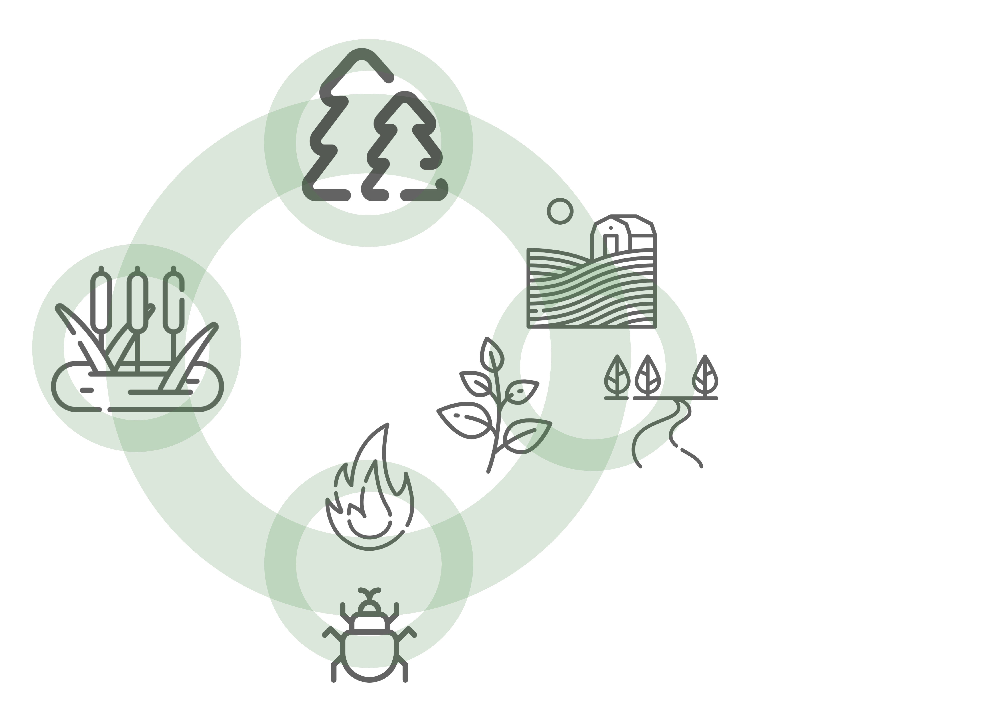

---
output:
  html_document:
    toc: false
    toc_float: false
---

```{js, echo=FALSE}
$("#pageContent").removeClass("standardPadding");
```


<!--html_preserve-->

<div id="homeContent">
  <div class="band full blue first rightText">
    <div class="bandContent vCenter">
      <div class="blurb">
        <div class="tagline">CASFRI takes the forest resource inventory datasets from all jurisdictions in Canada, and combines them into a single standardized dataset.</div>
      </div>
    </div>
    
  </div>

  <div class="band full gray1 second leftText">
    <div class="bandContent vCenter">
      <div class="blurb">
        <div>CASFRI includes data on forests, wetlands, non-forested elements such as shrubs, anthropogenic use and lakes/rivers, and disturbances such as fire and insects.</div>
      </div>
    </div>
    
  </div>

  <div class="band full third rightText">
    
    <div class="bandContent vCenter">
      <div class="blurb">
        <div>
          Datasets are stitched together across Canada, and repeated datasets in the same area are stacked to create a historical record of current and past conditions. This means CASFRI can be used to find the best available inventory information for any region in Canada, at any point in time.
        </div>
      </div>
    </div>
  </div>
  
  <div class="band full gray2 fourth centerText">
    <div class="bandContent">
      <div class="blurbCenter">
        <hr>
        <div>
        CASFRI is an open source project using PostgreSQL, PostGIS, GDAL and R. The project is stored on <a href="https://github.com/edwardsmarc/CASFRI">github</a>.
        </div>
      </div>
      <div>
        <a href="https://www.postgresql.org/"></a>
        <a href="https://postgis.net/"></a>
        <a href="https://gdal.org/"></a>
        <a href="https://www.r-project.org/"></a>
      </div>
    </div>
  </div>
</div>

<!--/html_preserve-->
