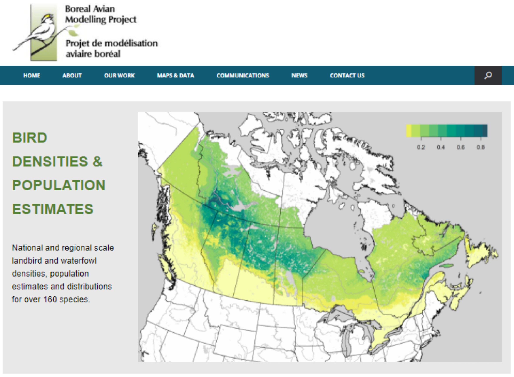
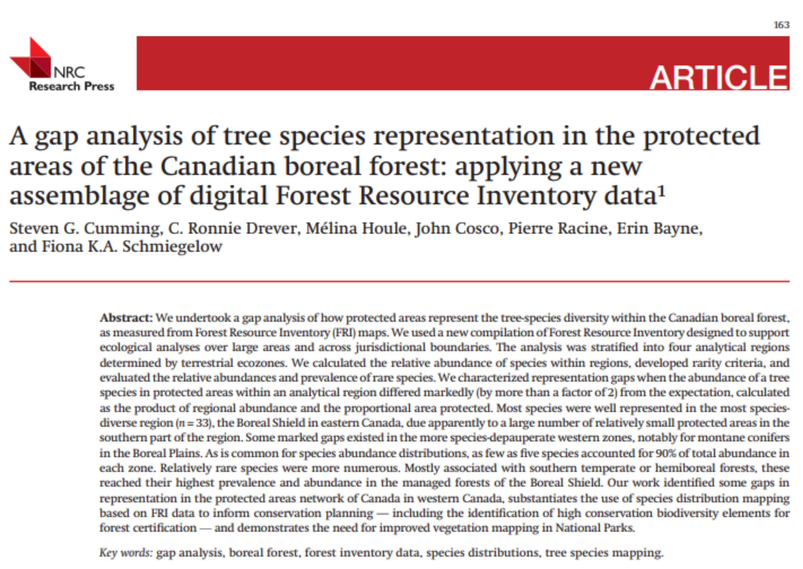

---
output:
  html_document:
    toc: false
    toc_float: false
---

# Projects and Publications
The following projects and publications are examples of CASFRI in action!

<!--html_preserve-->

  

    
Projects

    
CASFRI has been used in a range of projects requiring continuous coverage of forest attributes.

    

      

        
        <a href="https://borealbirds.ualberta.ca/" class="projectItemLabel">The Boreal Avian Modelling Project</a>
        
The BAM project has used CASFRI to model bird density and habitat associations using continuous coverages of forest attributes across the Canadian boreal.

      

      

        
        <a href="https://nfi.nfis.org/en/" class="projectItemLabel">Canada's National Forest Inventory</a>
        
The NFI has applied the CASFRI framework to develop an ongoing historical database of Canada's forests.

      

    

  

  

    
Publications

    
The following is a list of publications using CASFRI.

    

      

        
        <a href="https://cdnsciencepub.com/doi/abs/10.1139/cjfr-2014-0102" class="projectItemLabel">A gap analysis of tree species representation in the protected areas of the Canadian boreal forest</a>
        
Cumming et al. 2015 used CASFRI to conduct a gap analysis of tree species representation in Canada's protected area network.

      

    

  

<!--/html_preserve-->
